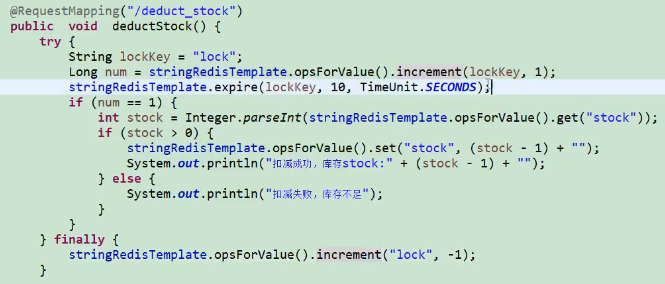

​                                                                 **java总结**

java相关的博客：<https://blog.kuangstudy.com/>

 **1. java的跨平台原理**

​	应为java有自己的虚拟机在不同平台上运行java虚拟机使得接口统一，不同平台上jvm不同，java通过不同版本及不同位数的jvm来屏蔽不同的系统间的指令集的差异，对外提供统一的javaapi接口，

**2.java基础知识**

​      java中有8中数据类型 int 8位4个字节  boolean 1 位   char  2字节  byte 1字节  short 2字节  long  8字节  float 4字节  double 8字节

**3.面向对象的特征有哪些方面**

​     封装（高度自治的封闭个体，对外提供获取自己或改变自己的方法），继承（可以继承一个类的的同时改变其中的一些内容），多态（引用变量指向具体类型 父类已用指向子类对象），抽象（把现实生活中的共同特征对象抽象为类）

**4.基本类型与包装类型**

​     为什么要有包装类型 ？java是一个面向对象的语言而基本的数据类型部具备面向对象的特性 如

null->integer 0->int 在数据库中容易歧义

**5.“==”和equals方法有什么区别**

"=="用来判断两个变量之间的值是否相等，变量分为基本数据类型和引用数据类型，基本数据类型直接比较值，而引用数据类型比较的是地址值

“equals” 用来比较两个对象长得是否一样，判断两个对象的某些特征是否一样，实际上就是调用对象的equals方法，基本数据类型没有equals方法

**6.string 和stringbuilder，stringbuffer和stringbuilder的区别**

string 是内容不可变的字符串，底层是一个不可变的字符数组（final char[]），而stringbuilder和stringbuffer是内容可变的字符串，底层使用的可变的字符数组可用append方法改变，拼接字符串不能使用string进行拼接，要使用stringbuffer和stringbuilder     stringbuffer和stringbuilder的区别stringbuffer线程安全，效率低和stringbuilder线程不安全，效率高

**7.java中的集合**

​	java中的集合分为value和key-value(collection map)两种

​     存储值分为list和set 存储key-value为map

​	list是有序的可重复的

​	set是无序的不可重复的，根据equals和hashcode来判断，也就是如果一个对象要存储到set中必须要重写equals和hashcode方法

**8.list**

​	list常用的arraylist和linklist，区别和使用场景

​	arraylist底层使用的数组（具有索引查询特定的元素很快而插入和删除修改比较慢，因为数组在内存中是一块连续的内存，如果插入删除时需要移动内存），linklist底层使用链表（不要求内存是连续的，在当前元素中存放上一个和下一个元素的地址查询时需要从头部开始一个一个的找索引，查询效率低而插入时不需要移动内存，只需改变引用指向即可，所以插入或者删除的效率高）

arraylist使用在查询比较多，但是插入和删除比较少的情况，linklist相反

**9.hashMap和hashTable，currenthashmap的**区别

​	hashmap和hashtable都可以使用存储key-value的数据，hashmap是可以把null作为key或value的，而hashtable是不可以的，hashmap是线程不安全的，效率高，而hashtable是线程安全的，效率低

​	既想线程安全又想效率高？currenthashmap （把大的分成多个小的）通过把整个map分为N个segment（类似hashtable），可以提供相同的线程安全，但是效率提升N倍，默认提升16倍

hashMap和treeMap的区别？1.首先hashMap和treeMap都是线程不安全的；2.hashMap是基于哈希表实现的， 使用HashMap要求添加的键类明确定义了hashCode()和equals() treeMap是基于红黑树实现的， TreeMap没有调优选项，因为该树总处于平衡状态；3.hashMap是无序的，treeMap是有序的。

**10.实现一个拷贝文件的工具使用自字节流是字符流**

​	纯文本用字符流，其他用（有声音图片的）字节流

**11.线程的几种实现方式，怎么启动？怎么区分？线程池？线程病发率**

​	方式1，通过继承Thread类实现一个线程    继承的扩展性不强，java只有单继承，如果一个类继承Thread就不能继承其他类了

​	方式2，通过实现Rannable接口实现一个线程

​	怎么启动？Thread thread =new Thread(继承了Thread的对象/实现了Runnable接口) Thread.start(启动线程的方法)  启动后执行的是run方法

​	怎么区分线程？在一个系统中有很多线程，每个线程都会打印日志，我想区分是哪个线程怎样标识？可以设置一个线程名称 thread.set("name") 是一种规范

**12.有没有使用过线程并发库？**

​	线程池的作用？限定线程的个数，不会导致由于线程过多导致系统运行缓慢或崩溃；线程池在开始不需要。后期会增加

**13.设计模式，常用的有哪些**？

​	设计模式就是经过前人无数次实践过程中可以反复使用解决特定问题的设计方法。

​	**常用的是**：单例模式  分为饱汉式（需要的时候才创建实例）饿汉式（一出来就创建单实例） 1.构造方法私有化，让除了自己类中能创建外，其他地方都不能创建     2.在自己的类中创建一个单实例  3.提供一个方法获取该实例对象

```java
饿汉式

public class Singleton {  

    private static final Singleton instance = new Singleton();  

    private Singleton (){}  

    public static Singleton getInstance() {  

     return instance;  

    }  

}


懒汉式

public class Singleton {  

    private static Singleton instance;  

    private Singleton (){}   

    public static Singleton getInstance() {  

     if (instance == null) {  

         instance = new Singleton();  

    }  

    return instance;  

    }  

}  
```

​	工厂模式：springIOC就是使用了工厂模式，对象的创建交给一个工厂去创建

​	代理模式：SpringAOP就是使用的动态代理

​	包装模式

**14.http get和post的区别？**

​	get 请求的参数会符在url之后（就是把数据放置在http协议头中），以？分割，多个参数用&连接；post提交：把提交的数据放置在http的包体中，因此get在地址栏能看到，post看不到；

​	传输数据大小get（数据有限），post（没有）；

​	安全性get（地址栏会显示） post（不显示）

**15.说下对servlet的理解？**

​	servlet是服务器端的程序，运行在服务器端主要用于交互式浏览和修改数据，生成动态web内容，httpServlet重写doGet和doPost方法，也可以重写service方法完成get post的请求

**16，servlet的生命周期**

​	它的生命周期由java.servlet接口的init，service和destroy方法来表达

​	servlet启动时，开始加载servlet生命周期开始。servlet被服务器实例化后，容器运行其init方法，请求到达时运行service方法，service方法自动请求对应的doxx方法，当服务器销毁实例时调用destroy方法

**17.jsp和servlet有哪些相同点和不同点，它们之间的联系是什么？**

​	所有的jsp文件都会被翻译为一个继承HttpServlet的类，也就是jsp最终也是一个servlet，这个servlet对外提供服务

​	不同点：jsp侧重于视图，而servlet主要用于控制逻辑l

​	jsp中9个内置对象：

request，response,pagecontext,session,application,out,config,page,exception

​	jsp中4大作用域：

pageContext，request，session，application

​	jsp传值：request，session，application，cookie

**18.session和cookie的区别**

​	cookie在客户端记录用户信息，session是在服务端，但是session的实现依赖于cookie，sessionId存放在cookie中，单个cookie保存数据不能超过4k，一个站点最多20 个cookie，当客户端禁用cookie时，就采用cookie+数据库方式

**19.数据库**

​	非关系型数据库：redis，memcache,mongodb,hadoop等

关系型数据库的三泛式：

​	第一范式，是根据数据库表中的每一列都不可以分割的基本数据项，同一列中不能有多个值，即实体类中的某个属性不能有多个值或者不能有重复的属性，（列数据不可分割）

​	第二范式，数据库表中的每行必须可以被唯一区分，为实现区分通常为表加上一列，存储各个实例的唯一标识。（即主键）

​	第三范式，要求一个数据库表中不包含已在其他表中已包含的非主键字信息（外键）

反三范式：有的时候为了效率，可以设置重复字段 

**20.事务（ACID）**

​	原子性 ：表示事务操作不可分割，要么成功，要么失败

​        一致性：要么都成功，要么都失败，后面失败了要对前面的操作进行回滚 

​	 隔离性：一个事务开始后不能受其他事务干扰

 	持久性：表示事务开始了就不能终止可持久到硬盘

**21.mysql数据库的默认的最大连接数**

​	为什么需要最大连接数？特定服务器上的数据库只能支持一定数目的连接，数据库安装时都会有一个最大连接数100，我们一般都会设置最大连接时

**22.mysql分页和oracl分页**

​	mysql用limit进行，limit offset，size

​	oracl的分页有点记不住，使用了三层嵌套查询

**23.触发器**

​	触发器要有触发条件，触发器效率高

**24.存储过程**

**25.简单说下你对jdbc的理解**

​	java database connection java只定义接口，让数据厂商自己实现接口，对于我们而言，只需要导入对应厂商开发的实现即可，然后以接口方式进行调用（mysql+mysql驱动即mysql接口实现+jdbc）。

**26.jdbc中preparedStatement相比statement的好处**

​	1.preparedstatement是预编译的，比statement速度快，还能有效防止sql注入

​	2.代码的可读性和可维护性好

**27.写一个简单的jdbc的程序？**

​	“贾连欲执事”    加载驱动  获取连接（DriverManager.getconnection(url,user,pw )）  设置参数  执行  释放连接（释放连接要从小到大，放在finaly里）

**28.数据库连接池的作用？**

​	限定个数，节约系统资源，加快响应时间

**29.介绍 一下ajax？**

​	什么是ajax？（异步的javascript和xml）作用是什么？（数据异步交换，局部刷新数据）怎么实现？（ajaxXmlhttprequest对象，使用这个对象异步发送数据，获取响应，完成局部更新）应用场景？（登录场景，失败时跳转，注册时提示用户名是否存在，二级联动等）

**30.js和jquery？**

​	jQuery是一个js框架，封装了js的属性和方法，并且增强了js的功能，让用户使用起来更加便利，原来使用js时要处理兼容性问题，现在有jQuery封装了底层好多了，原生的js的dom和事件绑定非常麻烦。

**31.jquery的常用选择器？**

​	ID选择器，class选择器，标签选择器，通用选择器

**32.jquery中的ajax和原生js实现ajax有什么关系？**

​	jquery中的ajax也是通过原生的js封装的，如果采用原生的js实现ajax是麻烦的，即使我们不使用jquery也要封装对象的方法和属性。

**33.spring的核心**

​	spring是IOC和AOP的容器  IOC控制反转，我的service需要调用dao，service就需要创建dao，在使用spring之后，spring发现你的service依赖与dao就给你注入。核心原理：就是工厂模式（容器map）+反射+配置文件。

​	AOP：面向切面编程，核心原理：使用动态代理的方式在执行前后或出现异常做相关的逻辑，我们主要使用aop做 （1.事务处理，2.权限判断 3.日志）

**34.spring的事物的传播特性**

**35.spring解析**（<https://blog.csdn.net/java_lyvee/article/details/101793774>）

​	1.spring中的循环依赖怎解决的？spring中是默认单例支持循环的

​	2.怎么证明他默认他默认支持的？怎么关闭循环依赖？spring解决循环依赖的细节

依赖注入的功能---在初始化时完成，初始化时干的工作？

​	1.初始化bean--bean有一个初始化的过程-------spring bean的生命周期

​	2.spring的生命周期到底在哪个步骤完成的依赖注入？

​	3.spring bean的产生过程------------------bean是由什么产生来的

​		class-----beanDefinition----------object（bean）

  	4.spring的实例化流程 ：（1）先scan扫描类，把要创建的类扫描出来，进行一个for循环拿到扫描出来的类，但是他不知道要不要创建，所以它要进行解析，（2）创建了一个beandefinition类，然后把类的属性set进去（比如是不是懒加载，或者类的scope），解析完后，（3）把他放put到一个map中；（4）然后看看你是否对spring进行了扩展，如果要扩展要实现一个beanfactorypoatprocessor；（5）遍历map，将解析出来的类遍历出来在决定要不要new

**36.spring bean的作用域**

​	bean的作用域范围可以再scope属性中设置，默认情况下，spring只为每个在IOC容器中声明的bean创建一个都实例，整个容器范围内都能共享该实例，所有后续的getbean（）都返回唯一的bean实例，该作用域成为singleton，还有prototype域（每次调用getbean时会返回一个新实例调用）   

request域（每次HTTP请求回创建一个新的bean）  session域（在一个会话中共享一个bean）

**springmvc流程：** 


**37.如何解决中文乱码问题？**

​	post请求中在charetfilter中设置encoding值，我们可以在web.xml中设置初始化参数

```html
 <init-param>  

​	<param-name>encoding</param-name>

​        <param-value>utf-8</param-value>

<init-param> 

   <init-param>  

​	<param-name>foreencoding</param-name>

​        <param-value>true</param-value>

<init-param> 
```

针对get请求乱码问题最简单的就是修改tomcat的server.xml来修改urlencoding=utf-8

**38.Mybatis中当实体类中的属性名和表中的字段名不一样，怎么办？**

​	解决方案：

​	1.写sql语句时起别名

​	2.在mybatis的全局配置文件开启驼峰命名规则，在mybatis-config。xml中

​	3.在mapper的映射文件中使用resultMap来自定义映射规则

A.单表查询

```xml
<select id="selll" resultMap="userMap">       
 select id u_id,name u_name,age u_age from users
</select>
 <resultMap type="com.zhiyou100.xf.bean.Users" id="userMap">
  <id column="u_id" property="id"/><!--作为唯一标识的映射-->
  <result column="u_name" property="name"/><!--其他普通字段的映射-->
  <result column="u_age" property="age"/><!--property实体类中的属性名，cloumn：表中的字段名-->
</resultMap>
```

B.关联查询 一对一、多对一  实体类中将另一个类作为属性association

一对一：

```xml
<!-方式一：嵌套结果：使用嵌套结果映射来处理重复的联合结果的子集 封装联表查询的数据(去除重复的数据) select * from class c, teacher t where c.teacher_id=t.t_id and c.c_id=1 -->

 <select id="getClass" parameterType="int" resultMap="ClassResultMap">
 select * from class c, teacher t where c.teacher_id=t.t_id and c.c_id=#{id} 
</select> 
<resultMap type="_Classes" id="ClassResultMap">
 <id property="id" column="c_id"/> 
<result property="name" column="c_name"/>
 <association property="teacher" column="teacher_id" javaType="_Teacher">
 <id property="id" column="t_id"/> <result property="name" column="t_name"/> </association> 
</resultMap>
<!-
方式二：嵌套查询：通过执行另外一个 SQL 映射语句来返回预期的复杂类型 SELECT * FROM class WHERE c_id=1; SELECT*FROMteacherWHEREt_id=1 //1 是上一个查询得到的 teacher_id 的值
-->
<select id="getClass2" parameterType="int" resultMap="ClassResultMap2"> 
select * from class where c_id=#{id} 
</select> 
<resultMap type="_Classes" id="ClassResultMap2"> 
<id property="id" column="c_id"/> 
<result property="name" column="c_name"/>
 <association property="teacher" column="teacher_id" javaType="_Teacher" select="getTeacher">
 </association> 
</resultMap>
<select id="getTeacher" parameterType="int" resultType="_Teacher"> 
SELECT t_id id, t_name name FROM teacher WHERE t_id=#{id} 
</select>
```

一对多： 实体类中将另一个类的list作为属性collection 

```xml
<select id="selAll" resultMap="AllMap">
        select * from teacher,student,class where c_id=class_id and teacher_id=t_id and c_id=#{id}
    </select>
    <resultMap type="com.zhiyou100.xf.bean.Classes" id="AllMap">
        <id column="c_id" property="cid"/>
        <result column="c_name" property="cname"/>
        <association property="teacher" javaType="com.zhiyou100.xf.bean.Teacher">
            <id column="t_id" property="tid"/>
            <result column="t_name" property="tname"/>
        </association>
        <collection property="students" ofType="com.zhiyou100.xf.bean.Student">
            <id column="s_id" property="sid"/>
            <result column="s_name" property="sname"/>
        </collection>
    </resultMap>
```

mybatis中查询部门树之collection得嵌套子查询

```sql
 <select id="getAllDepartmentsByParentId" resultMap="DepartmentWithChildren">
    select * from department where parentId=#{pid};
  </select>
 
 <resultMap id="BaseResultMap" type="org.javaboy.vhr.model.Department">
        <id column="id" property="id" jdbcType="INTEGER"/>
        <result column="name" property="name" jdbcType="VARCHAR"/>
        <result column="parentId" property="parentId" jdbcType="INTEGER"/>
        <result column="depPath" property="depPath" jdbcType="VARCHAR"/>
        <result column="enabled" property="enabled" jdbcType="BIT"/>
        <result column="isParent" property="isParent" jdbcType="BIT"/>
    </resultMap>
    
    
<resultMap id="DepartmentWithChildren" type="org.javaboy.vhr.model.Department"   		extends="BaseResultMap">
        <collection property="children" ofType="org.javaboy.vhr.model.Department"
		select="org.javaboy.vhr.mapper.DepartmentMapper.getAllDepartmentsByParentId"     		 column="id"/>
 </resultMap>
此处select表示拿着查询到得id为条件再次执行select * from department where parentId=#{pid};语句

实体类中存放list集合
private List<Department> children = new ArrayList<>();

```

mybatis中查询菜单用法

```sql
 <select id="getAllMenus" resultMap="MenuWithChildren">
    select m1.`id` as id1,m1.`name` as name1,m2.`id` as id2,m2.`name` as name2,m3.`id` as id3,m3.`name` as name3 from menu m1,menu m2,menu m3 where m1.`id`=m2.`parentId` and m2.`id`=m3.`parentId` and m3.`enabled`=true order by m1.`id`,m2.`id`,m3.`id`
  </select>
  
  <resultMap id="MenuWithChildren" type="org.javaboy.vhr.model.Menu" extends="BaseResultMap">
    <id column="id1" property="id"/>
    <result column="name1" property="name"/>
    <collection property="children" ofType="org.javaboy.vhr.model.Menu">
      <id column="id2" property="id"/>
      <result column="name2" property="name"/>
      <collection property="children" ofType="org.javaboy.vhr.model.Menu">
        <id column="id3" property="id"/>
        <result column="name3" property="name"/>
      </collection>
    </collection>
  </resultMap>
  
  实体类：
  private Integer id;
    private String url;
    private String path;
    private String component;
    private String name;
    private String iconCls;
    private Meta meta;
    private Integer parentId;
    private Boolean enabled;
    private List<Menu> children;
    private List<Role> roles;
```

**39.linux系统常用服务类相关命令？**

​	1.service network status 查看网络状态

​	2.chkconfig --list列取服务 用来设置自启动 

​	3.查看进程  ps -ef | grep mysql

**40.Redis持久化**
	rdb 节省空间，恢复快，fork一个子进程数据量大也很慢，满足条件才存储，

​	aof以日志方式，细粒度，增量备份，丢失数据概率低，数据是日志格式，站空间，恢复速度慢有读写存在一定性能压力，存在个别bug

**41.git常用操作**

​	第一次创建用户 git config --global user.name="用户名"     git config --global user.email=“邮箱”  只创建一次就够了

1.git status  查看当前状态 	  2.git add 文件名1 文件名2（可以添加一个或者多个）  添加到缓存区	     3.git .  添加当前目录到缓存区中

提交至版本库：git commit -m “注释内容”

查看版本：git log --pretty=online

回退操作：git reset --hard 提交编号

回到过去后要想在回到当前最新版本时，则需要指令区查看历史操作，已得到最新的commit id 使用指令 git reflog 查看版本号在通过 git reset --hard 版本号回到现在

**42.GitHub上两种常规使用方式**

​	1.基于http协议

​	a.创建空目录，名称就叫shop

​	b.使用clone指令克隆线上仓库到本地 语法：git clone +线上仓库地址 

​	c.在仓库上做对应的操作（提交暂存区，提交本地仓库，提交线上仓库，拉取线上仓库）

​		提交到线上仓库的指令：git push 在首次往线上仓库提交时出现403致命错误，原因是不是谁都能提交的必须鉴权，需要修改“./git/config”文件内容

​	d.拉取线上最新版本 git pull  上班时要经常拉取

​	2.基于ssh协议的

​		该方式与前面的HTTPS方式相比，只是影响GitHub对于用户的身份鉴权的方式，对其他没影响。

生成公私钥对指令（需要自行安装openssh） ssh-keygen-t rsa -C "注册的邮箱"

​	步骤：a.生成客户端公私钥文件  b.将文件上传到GitHub

  	 **分支指令**

​	1.查看分支：git branch

​	2.创建分支：git branch 分支名

​	3.切换分支：git checkout 分支名

​	4.删除分支：git branch -d 分支名

​	5.合并分支：git merge 被合并的分支名

**43.冲突的产生与解决**

​	同事早我下班后修改了线上代码，此时我本地仓库内容与线上不一致，第二天上班后没拉取代码，直接修改了本地仓库的内容，然后下班提交代码产生冲突。

​	解决冲突：当执行git pull时显示已经合并。打开冲突文件，解决冲突。

​	解决方法：需要和同事（谁提交的，看代码如何保留，将改好的再次提交即可）

​	如果都保留包标记删除后提交即可，如果不想保留谁的删除提交即可 

解决乱码问题可在bash窗口下依次执行：

git config  core.quotepath off

git config  --unset i18n.logoutputencoding

git config  --unset i18n.commitencoding

忽略目录：在当前目录下创建一个./gitignore文件夹，在里面写上要忽略提交的文件名称

**44.并发编程与高并发**

​	多个线程操作同一个资源

​	线程的生命周期：1.新建    2.就绪    3.运行     4.阻塞      5.死亡	

**45.常用的设计模式？**

​	1.单例模式   <https://www.cnblogs.com/songyoulian/p/10029785.html>

​	2.工厂模式  <https://www.cnblogs.com/songyoulian/p/10053074.html>

​	3.装饰模式：又叫包装模式，通过对客户端透明的方式来扩展对象的功能，是继承关系的一种替换，符合开闭模式；在不改变原有对象的基础之上，将功能附加到对象上。提供了比继承更有弹性的替代方案（扩展原有对象功能）

使用场景：

1. 扩展一个类的功能或者给一个类添加附加职责
2. 给一个对象动态的添加功能，或动态撤销功能。

**46.有关JVM相关**？

​	

​	实例变量放在堆内存中；静态变量+常量（private，static，final，string）+类信息+运行时常量存在方法区    **栈管运行  ，堆管存储**  **垃圾回收只发生在堆中**   **jvm优化主要是优化堆**

​	基本类型的变量和对象的引用变量都是在函数的栈内存中分配，栈中不存在垃圾回收问题

 

当对象被new时发生在新生区的伊甸园区；

养老区：一般是数据库连接池这种池类对象在这；

永久区：没有垃圾回收用于存放运行环境所必需的的类信息，关闭jvm才释放内存 java7叫做永久代，java8叫做元空间


​		


永久代就是方法区


GC是什么？

​	频繁收集young区（普通GC,用到的算法是复制算法（coping）不会产生内存碎片，就是有点浪费空间）； 较少收集Old区(全局GC，一般是由标记清除或者是标记清除与标记整理的混合实现)； 基本不动perm区

**47.索引的数据结构？**

   数据结构分为：**二叉树**：（key（查找的值）-value（磁盘地址）结构），当数据出现单边增长的时候在用二叉树查找不太合适，	

​     **红黑树** ：如果出现单边增长的话他会自平衡，但是如果存储大数据量的话它的树的高度会很大，导致磁盘IO会很频繁

   

​      **hash表**  只要走了hash不管你的表的数据有多大，通过hash运算只需要一次磁盘io就能找到数据地址，但是如果是范围查找，hash算法就不行了

​     **b-tree**（mysql底层用的其实是b+tree，应为b-tree不能解决范围查找，虽然解决了红黑树树高的问题）  叶节点具有相同的深度，叶节点的指针为空，节点中的数据索引从左到右递增排列

​     **b+tree**：非叶子节点不存储data，只存储索引，可以放更多的索引，叶子节点不存储指针，顺序访问指针，提高区间访问的性能（树的高度为3时就可存储2千万条数据）

索引的优缺点：

优点：可以快速检索，减少I/O次数，加快检索速度；根据索引分组和排序，可以加快分组和排序；

缺点：索引本身也是表，因此会占用存储空间，一般来说，索引表占用的空间的数据表的1.5倍；索引表的维护和创建需要时间成本，这个成本随着数据量增大而增大；构建索引会降低数据表的修改操作（删除，添加，修改）的效率，因为在修改数据表的同时还需要修改索引表；

**48.存储引擎**

​	存储引擎到表级别常用的Innodb，MYSIAM

​	如果是myisam存储引擎的话在mysql的安装文件目录下的data文件夹下一个实例下边有三个文件分别为：

​        .frm		存储表结构相关的信息

​	.MYD	存储的是表结构中的所有的数据行信息

​	.MYI	存储的是表的索引

如果存储引擎是innodb的话有两个文件：

​	.frm:

​	.ibd:

​	什么是聚集索引？ 叶节点包含了完整的数据记录（把索引元素和数据元素聚集到一起）

​		innodb的主键索引其实就是聚集索引 myisam就是非聚集所引

​	为什么innodb表必须要有主键，并且推荐使用整型的自增所引（应为效率高，节省磁盘空间）？

​	     InnoDB引擎表是基于B+树的索引组织表(IOT)；每个表都需要有一个聚集索引(clustered index) 数据都是由b+tree来维护的，所以要有主键索引

 **InnoDB和MyIsam的区别？**

1.MyIsam默认表类型不是事务安全的，InnoDB是支持事物的

2.MyIsam不支持外键，InnoDB支持外键

3.MyIsam支持表级锁（不支持高并发，以读为主）， innodb支持行锁（共享锁，排它锁，意向锁），粒度更小，但是在执行不能确定扫描范围的sql语句时，innodb同样会锁全表。

4.执行大量select时MyIsam是最佳选择，执行insert，updata最好用innodb

5.myisam在磁盘上存储上有三个文件.frm(存储表定义) .myd（存储表数据） .myi（存储表索引）；innodb磁盘上存储的是表空间数据文件和日志文件，innodb表大小只受限于操作系统大小。

6.myisam使用非聚集索引，索引和数据分开，只缓存索引；innodb使用聚集索引，索引和数据存在一个文件。

7.myisam保存表具体行数；innodb不保存。

 8.delete from table时，innodb不会重新建立表，而会一行一行的删除。  

**49.联合索引的底层存储结构长什么样？**

​	工作中常用，

**50.mysql常用的命令？**

看你的mysql现在已提供什么存储引擎:  show engines;

看你的mysql当前默认的存储引擎:show variables like '%storage_engine%';

   7种表的join：

建表：	

```sql
CREATE TABLE `tbl_dept` (
 `id` INT(11) NOT NULL AUTO_INCREMENT,
 `deptName` VARCHAR(30) DEFAULT NULL,
 `locAdd` VARCHAR(40) DEFAULT NULL,
 PRIMARY KEY (`id`)
) ENGINE=INNODB AUTO_INCREMENT=1 DEFAULT CHARSET=utf8;
 
CREATE TABLE `tbl_emp` (
 `id` INT(11) NOT NULL AUTO_INCREMENT,
 `name` VARCHAR(20) DEFAULT NULL,
 `deptId` INT(11) DEFAULT NULL,
 PRIMARY KEY (`id`),
 KEY `fk_dept_id` (`deptId`)
 #CONSTRAINT `fk_dept_id` FOREIGN KEY (`deptId`) REFERENCES `tbl_dept` (`id`)
) ENGINE=INNODB AUTO_INCREMENT=1 DEFAULT CHARSET=utf8;
 
 
 
INSERT INTO tbl_dept(deptName,locAdd) VALUES('RD',11);
INSERT INTO tbl_dept(deptName,locAdd) VALUES('HR',12);
INSERT INTO tbl_dept(deptName,locAdd) VALUES('MK',13);
INSERT INTO tbl_dept(deptName,locAdd) VALUES('MIS',14);
INSERT INTO tbl_dept(deptName,locAdd) VALUES('FD',15);
 
 
INSERT INTO tbl_emp(NAME,deptId) VALUES('z3',1);
INSERT INTO tbl_emp(NAME,deptId) VALUES('z4',1);
INSERT INTO tbl_emp(NAME,deptId) VALUES('z5',1);
 
INSERT INTO tbl_emp(NAME,deptId) VALUES('w5',2);
INSERT INTO tbl_emp(NAME,deptId) VALUES('w6',2);
 
INSERT INTO tbl_emp(NAME,deptId) VALUES('s7',3);
 
INSERT INTO tbl_emp(NAME,deptId) VALUES('s8',4);
 
INSERT INTO tbl_emp(NAME,deptId) VALUES('s9',51);

```

7种查询：

```sql
1 A、B两表共有
 select * from tbl_emp a inner join tbl_dept b on a.deptId = b.id;
 
2 A、B两表共有+A的独有
 select * from tbl_emp a left join tbl_dept b on a.deptId = b.id;
 
3 A、B两表共有+B的独有
 select * from tbl_emp a right join tbl_dept b on a.deptId = b.id;
 
4 A的独有 
select * from tbl_emp a left join tbl_dept b on a.deptId = b.id where b.id is null; 
 
5 B的独有
 select * from tbl_emp a right join tbl_dept b on a.deptId = b.id where a.deptId is null; #B的独有
 
6 AB全有
#MySQL Full Join的实现 因为MySQL不支持FULL JOIN,下面是替代方法
 #left join + union(可去除重复数据)+ right join
SELECT * FROM tbl_emp A LEFT JOIN tbl_dept B ON A.deptId = B.id
UNION
SELECT * FROM tbl_emp A RIGHT JOIN tbl_dept B ON A.deptId = B.id
 
7 A的独有+B的独有
SELECT * FROM tbl_emp A LEFT JOIN tbl_dept B ON A.deptId = B.id WHERE B.`id` IS NULL
UNION
SELECT * FROM tbl_emp A RIGHT JOIN tbl_dept B ON A.deptId = B.id WHERE A.`deptId` IS NULL;

```

索引的创建删除语句

```sql
有四种方式来添加数据表的索引：
ALTER TABLE tbl_name ADD PRIMARY KEY (column_list): 该语句添加一个主键，这意味着索引值必须是唯一的，且不能为NULL。
 
ALTER TABLE tbl_name ADD UNIQUE index_name (column_list): 这条语句创建索引的值必须是唯一的（除了NULL外，NULL可能会出现多次）。
 
ALTER TABLE tbl_name ADD INDEX index_name (column_list): 添加普通索引，索引值可出现多次。
查看索引：
SHOW INDEX FROM TABLENAME \G
删除索引：
DROP INDEX[INDEXNAME] ON MYTABLE

查看sql详情
Explain + SQL语句
```

sql查询使用的类型：system > const > eq_ref > ref > range > index > all > all 一般能达到range级别最好能到ref级别

**51.权限认证shiro框架**

​	shiro提供了认证 授权  加密和会话管理等功能。

​	shiro是以过滤器的方式对访问规则进行控制，并且内置一系列过滤器 。大致分为认证过滤器和授权过滤器。

​	认证相关的有：anon(不认证也可以访问)  authbasic ，authc（必须认证才可以访问），user。

​	授权相关：perms（指定资源需要哪些权限才可以访问），roles，ssl，rest，port

spring整合shiro

​	spring提供一个简单的过滤器的处理方案，他将集体的操作交给内部filter对象delegate去处理，而这个delegate通过spring的IOC容器获取，这里采用spring的factorybean获取，虽然支配了一个filter，但是他并没有做实际的工作，而是交给spring容器中的为bean的名字的shirofilter类，即shirofactorybean，shiro过滤器工厂bean相当于间接地加载了9个内置过滤器


登录认证流程：1.创建令牌（对用户名和密码进行封装）  2.获取subject（主题应用程序与shiro交互的入口部分）    3.执行认证

自定义relam ：真正实现登录校验的人，shiro只是去调用它 。

shiro的三个核心组件：**subject（主题）**    **SecurityManger（安全管理器）**    **Relam(数据源)**。

**52.springsecurity（利用aop思想）？**

​	spring security 的核心功能主要包括：认证 （你是谁） 授权 （你能干什么） 	攻击防护 （防止伪造身份）

​	其核心就是一组过滤器链，项目启动后将会自动配置。最核心的就是 Basic Authentication Filter 用来认证用户的身份，一个在spring security中一种过滤器处理一种认证方式。

SecurityContextHolder，SecurityContext，Authentication是Spring Security的基础对象。

​	1. SecurityContextHolder：存储当前的SecurityContext，即认证用户的上下文信息，内部使用ThreadLocal。

​	2. SecurityContext：持有Authentication对象和其他可能需要的信息

​	3. UserDetails：从Authentication中获取的对象，代表当前用户的具体信息

UserDetailsService：获取UserDetails的逻辑，一般封装了查询用户的逻辑，内部只有一个方法：

 UserDetails loadUserByUsername(String username) throws UsernameNotFoundException;

​	4.GrantedAuthority：当前用户获取到的授权信息。

案例：配置SpringSecurity的安全信息

```java
@EnableWebSecurity
public class SecurityConfig extends WebSecurityConfigurerAdapter {

    // @formatter:off
    @Override
    protected void configure(HttpSecurity http) throws Exception {
        http
                .authorizeRequests()
                    .antMatchers("/css/**", "/index").permitAll()
                    
                    // 只有USER权限的角色才能访问/user/接口
                    .antMatchers("/user/**").hasRole("USER")
                    .and()
                .formLogin().loginPage("/login").failureUrl("/login-error");
    }

//  @Autowired
//  public void configureGlobal(AuthenticationManagerBuilder auth) throws Exception {
//      auth
//          .inMemoryAuthentication()
//              .withUser(User.withDefaultPasswordEncoder().username("user").password("password").roles("USER"));
//  }
    // @formatter:on

    // 密码明文
    @Bean
    public PasswordEncoder passwordEncoder() {
        PasswordEncoder encoder = NoOpPasswordEncoder.getInstance();
        return encoder;
    }


  // 获取用户的来源
    @Bean
    public UserDetailsService userDetailsService(){
        UserDetailsService userDetailsService = new UserDetailsService(){

            @Override
            public UserDetails loadUserByUsername(String username) throws UsernameNotFoundException {
                if (StringUtils.isEmpty(username) || !"admin".equalsIgnoreCase(username)){
                    return null;
                }

                HashSet<GrantedAuthority> hashSet = new HashSet<>();
                // 内部检验权限，要以ROLE为前缀
                hashSet.add(new  SimpleGrantedAuthority("ROLE_USER") );
                User user = new User("admin","test",hashSet);

                return user;
            }
        };
        return userDetailsService;
    }
}
```

 **53.存储过程与存储函数区别？**

​	（1）存储函数的限制比较多,例如不能用临时表,只能用表变量,而存储过程的限制较少，存储过程的实现功能要复杂些,而函数的实现功能针对性比较强。

　　（2）返回值不同。存储函数必须有返回值,且仅返回一个结果值；存储过程可以没有返回值,但是能返回结果集(out,inout)。

　　（3）调用时的不同。存储函数嵌入在SQL中使用,可以在select 存储函数名(变量值)；存储过程通过call语句调用 call 存储过程名。

　　（4）参数的不同。存储函数的参数类型类似于IN参数，没有类似于OUT和INOUT的参数。存储过程的参数类型有三种，IN、out和INOUT：

　　　　a. in：数据只是从外部传入内部使用(值传递),可以是数值也可以是变量

　　　　b. out：只允许过程内部使用(不用外部数据),给外部使用的(引用传递:外部的数据会被先清空才会进入到内部),只能是变量

　　　　c. inout：外部可以在内部使用,内部修改的也可以给外部使用,典型的引用 传递,只能传递变量。

**a.存储过程：**

​	

```sql
CREATE [OR REPLACE] PROCEDURE procedure_name[(parameter_name in|out|in out parameter_type, [, ...])]
{IS | AS}
  [columnName1 tableName.columnName1%type;
   columnName2 tableName.columnName2%type;
   ...
  ]
BEGIN
  < procedure_body >
END;
 
-- 语法说明：
-- ① 用[]包含的内容为可有可无，根据实际情况而定；
-- ② procedure_name：存储过程名称；
-- ③ parameter_name：参数名称；
-- ④ 参数模式：
--   in: 是参数的默认模式，这种模式就是在程序运行的时候已经具有值，在程序体中值不会改变；即，可以传入参数；
--   out：该模式定义的参数只能在过程体内部赋值，标识该参数可以将某个值传递回调用它的过程；即，可以返回值；
--   in out：表示该参数可以向过程中传递值，也可以将某个值传出去；即，既可以传入参数，也可以返回值；
-- ⑤ parameter_type：参数数据类型；
-- ⑥ is、as：在存储过程中，两者没有任何区别；但是在视图中只能用as，在游标中只能用is；
-- ⑦ procedure_body：PL/SQL子程序体；即该存储过程要执行的操作内容；
-- ⑧ 创建存储过程时，可以在is或者as后面添加对类型或变量的说明；

```

实例：创建添加员工信息的存储过程：

```sql
create or replace procedure addEmployee(eNo in out number, uName in out varchar2, dNo in out number, sal in out number, com in out number)
as
  empNo emp.empNo%type;
  usernName emp.username%type;
  deptNo emp.deptno%type;
  salary emp.salary%type;
  comm emp.comm%type;
begin
  insert into emp(empNo, username, deptNo, salary, comm)values(eNo, uName, dNo, sal, com);
end;
```

  PL/SQL调用存储过程：

```sql
declare
  empNo emp.empno%type := 7777;
  username emp.username%type := 'Hellen';
  deptNo emp.deptno%type := 10;
  salary emp.salary%type := 3800;
  comm emp.comm%type := 700;
begin
  addEmployee(empNo, username, deptno, salary, comm);
end;
```

**b.存储函数：**

创建语法：

```sql
CREATE [OR REPLACE] FUNCTION function_name[(parameter_name in parameter_type, [, ...])]
    RETURN returnValType
{IS | AS}
  [variable1 type;
   variable2 type;
   ...
  ]
BEGIN
  < procedure_body >
END;
 
-- 语法说明：
-- ① 用[]包含的内容为可有可无，根据实际情况而定；
-- ② function_name：存储函数名称；
-- ③ parameter_name：参数名称；
-- ④ in: 参数模式，存储函数只有in模式；
-- ⑤ parameter_type：参数数据类型；
-- ⑥ returnValType：函数返回值数据类型；
-- ⑦ is、as：在存储过程中，两者没有任何区别；但是在视图中只能用as，在游标中只能用is；
-- ⑧ variable、type：分别用于声明函数在执行过程中所需要的变量名称和数据类型； 
-- ⑨ procedure_body：PL/SQL子程序体；即该存储函数要执行的操作内容；
-- ⑩ 创建存储过程时，可以在is或者as后面添加对类型或变量的说明；
```

 实例：创建为员工加薪的存储函数

```sql
create or replace FUNCTION addSalary(eNo in number, addVal in number)
  RETURN number
AS
  pNo number;         -- 定义变量保存员工编号
  pName varchar2(30); -- 定义变量保存员工用户名
  pDeptNo number;     -- 定义变量保存员工部门编号
  pSal number;        -- 定义变量保存员工的工资
  pComm number;       -- 定义变量保存员工的奖金
  pTotal number;      -- 定义变量保存员工的总收入
  newSalary number;   -- 定义变量保存加薪后的工资
  newComm number;     -- 定义变量保存加薪后的奖金
BEGIN
  SELECT empNo, username, deptNo, salary, comm INTO pNo, pName, pDeptNo, pSal, pComm FROM EMP WHERE empNo=eNo;
  pTotal := (pSal+pComm)*12;
  DBMS_OUTPUT.PUT_LINE('员工'||pName||'：初始工资为='||pSal||'；初始奖金为='||pComm||'；初始年薪为='||pTotal);
 
  newSalary := pSal+pSal*addVal;
  newComm := newSalary*0.12;
  UPDATE EMP SET username=pName, deptNo=pDeptNo, salary=newSalary, comm=newComm WHERE empNo=pNo;
  RETURN newSalary;
END;
```

 PL/SQL调用存储函数，为编号为"2222"的员工加薪30%：

```sql
declare
  a number;        -- 定义变量，接受存储函数返回值
begin
  a := addSalary(1111, 0.3);    -- 调用存储函数
  DBMS_OUTPUT.put_line(a);      -- 打印存储函数返回值
end;
```

**54.Docker相关**

**docker镜像**：Docker镜像是由文件系统叠加而成（是一种文件的存储形式）。最底端是一个文件引导系统，即bootfs，这很像典型的Linux/Unix的引导文件系统。

一些常用命令：

列出docker下的所有镜像：docker images

 搜索镜像： docker search 镜像名称

 拉取镜像：docker pull centos:7   

  删除镜像： docker rmi $IMAGE_ID：删除指定镜像

 docker rmi `docker images -q`：删除所有镜像

**docker容器操作：** 

看正在运行容器：docker ps

查看停止的容：docker ps -f status=exited

创建容器命令：docker run

  -i：表示运行容器

  -t：表示容器启动后会进入其命令行。加入这两个参数后，容器创建就能登录进去。即分配一个伪终端。

 --name :为创建的容器命名。

-v：表示目录映射关系（前者是宿主机目录，后者是映射到宿主机上的目录），可以使用多个－v做多个目录或文件映射。注意：最好做目录映射，在宿主机上做修改，然后共享到容器上。

  -d：在run后面加上-d参数,则会创建一个守护式容器在后台运行（这样创建容器后不会自动登录容器，如果只加-i -t两个参数，创建后就会自动进去容器）。

  -p：表示端口映射，前者是宿主机端口，后者是容器内的映射端口。可以使用多个－p做多个端口映射

实例：创建一个交互式容器并取名为mycentos

docker run -it --name=mycentos centos:7 /bin/bash

创建一个守护式容器：如果对于一个需要长期运行的容器来说，我们可以创建一个守护式容器。

docker run -di  --name=mycentos2 centos:7

登录守护式容器方式：docker exec -it container_name (或者container_id)  /bin/bash（exit退出时，容器不会停止）

停止正在运行的容器：docker stop 容器名/id.

启动已运行过的容器：docker start $CONTAINER_NAME/ID

**a.**文件拷贝：如果我们需要将文件拷贝到容器内可以使用cp命令:   docker cp 需要拷贝的文件或目录 容器名称:容器目录

也可以将文件从容器内拷贝出来: docker cp 容器名称:容器目录 需要拷贝的文件或目录

**b.**目录挂载：

创建容器 添加-v参数 后边为   宿主机目录:容器目录

docker run -di -v  /usr/local/myhtml:/usr/local/myhtml --name=mycentos2 centos:7  挂载多级目录时我们需要添加参数  --privileged=true

查看容器地址：docker inspect mycentos

删除容器：l  docker rm $CONTAINER_ID/NAME

**c.**迁移与备份：

​	容器保存为镜像：docker commit pinyougou_nginx（容器名字） mynginx（新的镜像名字）

此镜像的内容就是你当前容器的内容，接下来你可以用此镜像再次运行新的容器。

​	镜像备份：docker  save -o mynginx.tar mynginx        -o 输出到的文件

​	镜像恢复与迁移：docker load -i mynginx.tar    -i 输入的文件

容器和镜像可以互相转换。

**55.vue.js相关**  https://cn.vue.js.org

​	vue.js的核心是一个允许采用简洁的模板语法来声明式地将数据渲染进dom的系统：

1.模板语法：

​	（1）插值

​		a.文本{{}}   b.如果想渲染纯HTML标签内容用指令v-html  防止一些攻击。

​	v-show=“属性” 控制节点是否显示   在dom中还存在

​	v-if=“属性”   如果为true 就创建节点，否则就删除节点（dom中就没了）

​	v-for=“（data,index或key） in或of datalist” 循环遍历即可拿到key值和索引值

​	

过滤方法(filter)：     indexof方法：“abc”.indexof("a") 判断a是否在“abc”中，在的话返回0，否则返回-1

```html
var arr=[1,2,3,4,5]
var newlist=arr.filter(item=>{
	return item>3
})
```

事件修饰符  阻止事件冒泡：@click.stop   @click.prevent="具体方法"  阻止默认事件

双向绑定事件：v-model.lazy 指令当失去焦点时触发，节省资源  v-model.number只绑定数字

 v-model.trim 去除空格

**vue组件**：

1.axios与fetch实现数据请求

fetch:	fetch("url").then(res=>res.json()).then(res=>consle.log(res));

axios:    axios.get().then(res=>{console.log(res.data(自动包装data属性))}).catch(err=>{console.log(err)})

2.计算属性

计算属性其实是在一个computed下定义的方法函数，使用时像一个属性一样去使用,计算属性性能高，它能缓存


3.虚拟dom与diff算法key的作用

​	虚拟dom能提高性能，因为它能够最大程度得保证组件，节点的可复用性，减少对dom的频繁操作

4.组件化开发：

定义全局组件：vue.component("组件名"，{template:}),可以在任何地方使用。

定义局部组件：components:{组件名:{tempalte:}}   在谁的内部定义谁能使用。

5.组件编写方式与vue实例的区别？

​	自定义组件需要有一个root element ；父组件的data是无法共享的；组件可以有data，methods，computed...但是data必须是一个函数


6.父组件传子组件（属性向下传）

​	props:["父组件中传递过来的属性名"]   接收父组件传来的属性


动态的绑定属性  在属性前面加":"来实现动态绑定，否则会把属性当成普通字符串来对待

属性验证 如果值是动态的加冒号来动态绑定

7.子传父组件间的通讯

​	在子组件中使用$emit()来触发父组件中的回调函数，即触发父组件中的方法执行


$event用来接收参数

8.ref的使用

​	ref放在标签上拿到的是原生节点；  ref放到组件上拿到的是组件对象


9.组件通信


10.动态组件

<component> 元素，vue内置的组件动态的绑定多个组件到它的is属性 <keep-alive> 保留状态，避免重新渲染


11.slot插槽（内容分发）具名插槽：具有名字的插槽，更精细的控制插入内容


使用插槽将父组件的内容混到了子组件中


12.vue-router

​	a.创建`components目录下存放我们自己编写的组件

​	b.定义一个Content.vue 的组件

```html
<template>
  <div>
 <h1>内容页</h1>
  </div>
</template>

<script>
 export default {
     name: "Content"
 }
</script>
```

​	c. 安装路由,在src目录下,新建一个文件夹 : router,专门存放路由

```html
import Vue from 'vue'
// 导入路由插件
import Router from 'vue-router'
// 导入上面定义的组件
import Content from '../components/Content'
import main from '../components/main'
// 安装路由
Vue.use(Router);
// 配置路由
export default new Router({
  routes: [
    {
      // 路由路径
      path: '/content',
      // 路由名称
      name: 'Content',
      // 跳转到组件
      component: Content
    }, {
      // 路由路径
      path: '/main',
      // 路由名称
      name: 'main',
      // 跳转到组件
      component: main
    }
  ]
});
```

d.在`main.js` 中配置路由

```html
import Vue from 'vue'
import App from './App'

// 导入上面创建的路由配置目录
import router from './router'

//来关闭生产模式下给出的提示
Vue.config.productionTip = false;

new Vue({
  el: '#app',
  // 配置路由
  router,
  components: { App },
  template: '<App/>'
});
```

e.在`App.vue`中使用路由

```html
<template>
  <div id="app">
    <!--
      router-link： 默认会被渲染成一个 <a> 标签，to 属性为指定链接
      router-view： 用于渲染路由匹配到的组件
    -->
    <router-link to="/">首页</router-link>
    <router-link to="/content">内容</router-link>
    <router-view></router-view>
  </div>
</template>

<script>
export default {
  name: 'App'
}
</script>

<style>
  #app {
    font-family: 'Avenir', Helvetica, Arial, sans-serif;
    -webkit-font-smoothing: antialiased;
    -moz-osx-font-smoothing: grayscale;
    text-align: center;
    color: #2c3e50;
    margin-top: 60px;
  }
</style>
```

13.参数传递及接收

​	a.前端传参数


​	b.路由中接收


​	c.组件中展示(展示时要用标签包裹)


方式2：通过pops解耦

​	a.前端传参数不用改变

​	b.路由中接收(允许使用pops接收)


​	c.组件中展示


重定向：

写完组件后要先把它配到路由中 import 组件名 from ' ' 在配置路由

14，钩子函数


- to：路由将要跳转的路径信息
- from：路径跳转前的路径信息
- next：路由的控制参数 

15.js相关（可参考`<https://www.cnblogs.com/weigaojie/p/10491085.html>`）

`let ` ： let命令，用来声明变量。它的用法类似于var，但是所声明的变量，只在`let命令所在的代码块`内有效  适用于for循环;先声明，在使用;不允许在相同作用域内重复声明同一个变量;let可以识别块级作用域

`const`:声明一个只读的常量。一旦声明，常量的值就不能改变。

声明常量的同时进行赋值，不赋值就会报错

可以识别块级作用域

不能重复声明

不存在变量提升【先访问在声明】

`数据类型`：根据在内存中的存储位置划分。基本数据类型存放在栈中，引用数据类型存放在堆中（指针存放在栈中，内容存放在堆中 ）

`基本数据类型`：undefined；null 【空占位符】；string 【也是对象】

`string中对象的方法`：

​	let 对象=new String（“  ”）；

​	对象.charCodeAt(2)  返回第2个位置的字符编码

​	查找元素    对象.charAt(0) 字符串的第0个位置的元素【查找字符】

​	查找下标     对象.indexOf（“ ”）   查找对应字符的下标，如果有返回下标，如果没有，返  回-1【第一 个字符开始的下标】

​	对象.lastIndexOf（“”） 倒着看查找，倒序看如果有返回下标，如果没有，返回-1【第一个字符开始的下标】

​	对象.lastIndexOf（“”） 倒着看查找，倒序看如果有返回下标，如果没有，返回-1【第一个字符开始的下标】

​	对象.match（“”）  有的话，返回数组【返回值，下标，包含返回值的数组】没有  返回null

​	字符串的截取：【返回新值，不改变原内容】

​	对象.substr（开始下标，【截取的长度】）

​	对象.substring（开始下标，结束的下标），从开始下标开始到结束下标之前，不取到结束的下标

​	对象.slice（开始下标，结束的下标），从开始下标开始到结束下标之前，不取到结束的下标【数组的方法】

​	字符串大小写【转换】let str="AbCdEf";str.toLowerCase() 

​	转换为小写str.toUpperCase() 转换为大写

​	替换：str.replace（“山”，“闪”）；

​	转换【字符串转换数组】let str=“1,2,3,4,5,6”；arr2=str.split（“，”）；

`引用数据类型`

​	object（属性与方法的集合）数组，函数，对象

​	深拷贝：let arr=【1,2,3,4】

​			let  arr1；

​			arr1=arr； ：传址

​			arr1 和 arr具有相同地址

​	浅拷贝：let arr=【1,2,3,4】；

​			let arr1=【】；

​			arr.foreach(function（value）{    arr1.push（value）})

​	三元运算符：表达式 ? 为真的执行语句：为假的执行语句

ajax请求：

​	ajax({                              

​		  url:'/',    必须有    

​		type:'get',    可有可无    

​		dataType:'text',     可有可无   

​		 data:{name:"zhangsan"},     可有可无   

​		 success:function(data){         可有可无       

​	         upDate(data)            },})


**56.vue的优缺点**

a.优点：

双向数据绑定  

 	通过MVVM思想实现数据的双向绑定，让开发者不用再操作dom对象，有更多的时间去思考业务逻辑。

组件化开发

​	我们可以像编程一样把模块封装 这就引入了组件化开发的思想。

虚拟dom

​	这个DOM操作属于预处理操作，并没有真实的操作DOM，所以叫做虚拟DOM。最后在计算完毕才真正将DOM操作提交，将DOM操作变化反映到DOM树上。

**57.spring面试相关**

**1.什么是spring？**

​	 Spring 框架指的都是 Spring Framework，它是很多模块的集合，这些模块是：核心容器、数据访问/集成,、Web、AOP（面向切面编程）、工具、消息和测试模块。比如：Core Container 中的 Core 组件是Spring 所有组件的核心，Beans 组件和 Context 组件是实现IOC和依赖注入的基础，AOP组件用来实现面向切面编程。

**2.列举一些重要的spring模块？**


Spring Core： 基础,可以说 Spring 其他所有的功能都需要依赖于该类库。主要提供 IOC 依赖注入功能。
Spring Aspects： 该模块为与AspectJ的集成提供支持。
Spring AOP ：提供了面向方面的编程实现。
Spring JDBC : Java数据库连接。
Spring JMS ：Java消息服务。
Spring ORM : 用于支持Hibernate等ORM工具。
Spring Web : 为创建Web应用程序提供支持。
Spring Test : 提供了对 JUnit 和 TestNG 测试的支持。

**3.谈谈自己对于springIOC和AOP的理解？**

​	IoC（Inverse of Control:控制反转）是一种设计思想，就是 将原本在程序中手动创建对象的控制权，交由Spring框架来管理。 IoC 在其他语言中也有应用，并非 Spirng 特有。 IoC 容器是 Spring 用来实现 IoC 的载体， IoC 容器实际上就是个Map（key，value）,Map 中存放的是各种对象。

将对象之间的相互依赖关系交给 IOC 容器来管理，并由 IOC 容器完成对象的注入。这样可以很大程度上简化应用的开发，把应用从复杂的依赖关系中解放出来。 IOC 容器就像是一个工厂一样，当我们需要创建一个对象的时候，只需要配置好配置文件/注解即可，完全不用考虑对象是如何被创建出来的。 在实际项目中一个 Service 类可能有几百甚至上千个类作为它的底层，假如我们需要实例化这个 Service，你可能要每次都要搞清这个 Service 所有底层类的构造函数，这可能会把人逼疯。如果利用 IOC 的话，你只需要配置好，然后在需要的地方引用就行了，这大大增加了项目的可维护性且降低了开发难度。Spring的IOC有三种注入方式 ：构造器注入、setter方法注入、根据注解注入。

**4.springAOP理解？**

​	OOP面向对象，允许开发者定义纵向的关系，但并适用于定义横向的关系，导致了大量代码的重复，而不利于各个模块的重用。

AOP，一般称为面向切面，作为面向对象的一种补充，用于将那些与业务无关，但却对多个对象产生影响的公共行为和逻辑，抽取并封装为一个可重用的模块，这个模块被命名为“切面”（Aspect），减少系统中的重复代码，降低了模块间的耦合度，同时提高了系统的可维护性。可用于权限认证、日志、事务处理。

​	AOP实现的关键在于 代理模式，AOP代理主要分为静态代理和动态代理。静态代理的代表为AspectJ；动态代理则以Spring AOP为代表。

（1）AspectJ是静态代理的增强，所谓静态代理，就是AOP框架会在编译阶段生成AOP代理类，因此也称为编译时增强，他会在编译阶段将AspectJ(切面)织入到Java字节码中，运行的时候就是增强之后的AOP对象。

（2）Spring AOP使用的动态代理，所谓的动态代理就是说AOP框架不会去修改字节码，而是每次运行时在内存中临时为方法生成一个AOP对象，这个AOP对象包含了目标对象的全部方法，并且在特定的切点做了增强处理，并回调原对象的方法。

**Spring AOP中的动态代理主要有两种方式，JDK动态代理和CGLIB动态代理：**

​        ①JDK动态代理只提供接口的代理，不支持类的代理。核心InvocationHandler接口和Proxy类，InvocationHandler 通过invoke()方法反射来调用目标类中的代码，动态地将横切逻辑和业务编织在一起；接着，Proxy利用 InvocationHandler动态创建一个符合某一接口的的实例,  生成目标类的代理对象。

        ②如果**代理类没有实现 InvocationHandler 接口**，那么Spring AOP会选择使用CGLIB来动态代理目标类。CGLIB（Code Generation Library），是一个代码生成的类库，可以在运行时动态的生成指定类的一个子类对象，并覆盖其中特定方法并添加增强代码，从而实现AOP。CGLIB是通过继承的方式做的动态代理，因此如果某个类被标记为final，那么它是无法使用CGLIB做动态代理的。

（3）静态代理与动态代理区别在于生成AOP代理对象的时机不同，相对来说AspectJ的静态代理方式具有更好的性能，但是AspectJ需要特定的编译器进行处理，而Spring AOP则无需特定的编译器处理。
**JDK动态代理实例（被代理类要有接口）：**

```java
//首先被代理的类需要实现一个接口
public interface ProxyInterface {
    public void say(String str);
}

//然后写一个实现类   也就是需要被代理的类
public class ProxyImpl implements ProxyInterface {
    @Override
    public void say(String str) {
        System.out.println("ProxyImpl.say is " +str);
    }
}

//然后写代理类
public class ProxyClass implements InvocationHandler {
    Object o;
    public void setTarget(Object o){
        this.o = o;
    }
    @Override
    public Object invoke(Object proxy, Method method, Object[] args) throws Throwable {
        System.out.println("在调用方法之前执行的方法");   
        method.invoke(o,args);
        System.out.println("在调用方法之后执行的操作");
        return null;
    }
}

//调用
//    jdk动态代理
    public static void main(String[] args) {
        ProxyInterface proxyInterface = new ProxyImpl();
        ProxyClass proxyClass = new ProxyClass();
        proxyClass.setTarget(proxyInterface);
	//传递被代理类的类加载器 接口  代理类  返回被代理类
        ProxyInterface proxy = (ProxyInterface)Proxy.newProxyInstance(proxyInterface.getClass().getClassLoader(),proxyInterface.getClass().getInterfaces(),proxyClass);
        System.out.println("------------------------------------------");
        proxy.say("hello");

        System.out.println(proxy.getClass().getName());
        System.out.println(proxyInterface.getClass().getName());
    }

```

**CGLIB动态代理实例（被代理类不需要要有接口）：**

```java
cglib动态代理的实现，原理
 
//被代理类 注意相对于jdk动态代理 cglib不需要一个公共接口-
package com.xyd.cglib;

public class CglibService {

    public  void  say(){
        System.out.println("我是被代理的方法 也叫做委托类");
    }
}

//实现cglib的接口MethodInterceptor

package com.xyd.cglib;

import net.sf.cglib.proxy.Enhancer;
import net.sf.cglib.proxy.MethodInterceptor;
import net.sf.cglib.proxy.MethodProxy;

import java.lang.reflect.Method;

public class CglibProxy implements MethodInterceptor {

    Object o;

    public Object getInstance(Object targer){
        this.o = targer;
        //cglib的核心原理 不需要接口，而是继承委托类
        Enhancer enhancer = new Enhancer();
        //产生目标类的子类
        enhancer.setSuperclass(this.o.getClass());
        //设置回调方法是MethodInterceptor的实现类
        enhancer.setCallback(this);
        //实例化我们构建的子类
        return enhancer.create();
    }
    public Object intercept(Object obj, 
    		Method method, 
    		Object[] args, MethodProxy proxy) throws Throwable {
        System.out.println("访问控制系统 启动···");
        proxy.invokeSuper(obj,args);
        System.out.println("你可真能闹儿");
        return null;
    }
}


//调用代码
package com.xyd.cglib;

public class MainCglib {
    public static void main(String[] args) {
        CglibService cglibService = new CglibService();
        CglibProxy cglibProxy = new CglibProxy();
        CglibService cglibSay = 
        (CglibService)cglibProxy.getInstance(cglibService);
        cglibSay.say();
    }
}
```

**5.BeanFactory和ApplicationContext有什么区别？**

​	BeanFactory和ApplicationContext是Spring的两大核心接口，都可以当做Spring的容器。其中ApplicationContext是BeanFactory的子接口。

（1）BeanFactory：是Spring里面最底层的接口，包含了各种Bean的定义，读取bean配置文档，管理bean的加载、实例化，控制bean的生命周期，维护bean之间的依赖关系。ApplicationContext接口作为BeanFactory的派生，除了提供BeanFactory所具有的功能外，还提供了更完整的框架功能：

①继承MessageSource，因此支持国际化。

②统一的资源文件访问方式。

③提供在监听器中注册bean的事件。

④同时加载多个配置文件。

⑤载入多个（有继承关系）上下文 ，使得每一个上下文都专注于一个特定的层次，比如应用的web层。

（2）①BeanFactroy采用的是延迟加载形式来注入Bean的，即只有在使用到某个Bean时(调用getBean())，才对该Bean进行加载实例化。这样，我们就不能发现一些存在的Spring的配置问题。如果Bean的某一个属性没有注入，BeanFacotry加载后，直至第一次使用调用getBean方法才会抛出异常。

        ②ApplicationContext，它是在容器启动时，一次性创建了所有的Bean。这样，在容器启动时，我们就可以发现Spring中存在的配置错误，这样有利于检查所依赖属性是否注入。 ApplicationContext启动后预载入所有的单实例Bean，通过预载入单实例bean ,确保当你需要的时候，你就不用等待，因为它们已经创建好了。

        ③相对于基本的BeanFactory，ApplicationContext 唯一的不足是占用内存空间。当应用程序配置Bean较多时，程序启动较慢。

（3）BeanFactory通常以编程的方式被创建，ApplicationContext还能以声明的方式创建，如使用ContextLoader。

（4）BeanFactory和ApplicationContext都支持BeanPostProcessor、BeanFactoryPostProcessor的使用，但两者之间的区别是：BeanFactory需要手动注册，而ApplicationContext则是自动注册

**6、请解释Spring Bean的生命周期？**

Servlet的生命周期：实例化，初始init，接收请求service，销毁destroy；

Spring上下文中的Bean生命周期也类似，如下：

（1）实例化Bean：

对于BeanFactory容器，当客户向容器请求一个尚未初始化的bean时，或初始化bean的时候需要注入另一个尚未初始化的依赖时，容器就会调用createBean进行实例化。对于ApplicationContext容器，当容器启动结束后，通过获取BeanDefinition对象中的信息，实例化所有的bean。

（2）设置对象属性（依赖注入）：

实例化后的对象被封装在BeanWrapper对象中，紧接着，Spring根据BeanDefinition中的信息 以及 通过BeanWrapper提供的设置属性的接口完成依赖注入。

（3）处理Aware接口：

接着，Spring会检测该对象是否实现了xxxAware接口，并将相关的xxxAware实例注入给Bean：

①如果这个Bean已经实现了BeanNameAware接口，会调用它实现的setBeanName(String beanId)方法，此处传递的就是Spring配置文件中Bean的id值；

②如果这个Bean已经实现了BeanFactoryAware接口，会调用它实现的setBeanFactory()方法，传递的是Spring工厂自身。

③如果这个Bean已经实现了ApplicationContextAware接口，会调用setApplicationContext(ApplicationContext)方法，传入Spring上下文；

（4）BeanPostProcessor：

如果想对Bean进行一些自定义的处理，那么可以让Bean实现了BeanPostProcessor接口，那将会调用postProcessBeforeInitialization(Object obj, String s)方法。

（5）InitializingBean 与 init-method：

如果Bean在Spring配置文件中配置了 init-method 属性，则会自动调用其配置的初始化方法。

（6）如果这个Bean实现了BeanPostProcessor接口，将会调用postProcessAfterInitialization(Object obj, String s)方法；由于这个方法是在Bean初始化结束时调用的，所以可以被应用于内存或缓存技术；

以上几个步骤完成后，Bean就已经被正确创建了，之后就可以使用这个Bean了。

（7）DisposableBean：

当Bean不再需要时，会经过清理阶段，如果Bean实现了DisposableBean这个接口，会调用其实现的destroy()方法；

（8）destroy-method：

最后，如果这个Bean的Spring配置中配置了destroy-method属性，会自动调用其配置的销毁方法。

**7、 解释Spring支持的几种bean的作用域？**

Spring容器中的bean可以分为5个范围：

（1）singleton：默认，每个容器中只有一个bean的实例，单例的模式由BeanFactory自身来维护。

（2）prototype：为每一个bean请求提供一个实例。

（3）request：为每一个网络请求创建一个实例，在请求完成以后，bean会失效并被垃圾回收器回收。

（4）session：与request范围类似，确保每个session中有一个bean的实例，在session过期后，bean会随之失效。

（5）global-session：全局作用域，global-session和Portlet应用相关。当你的应用部署在Portlet容器中工作时，它包含很多portlet。如果你想要声明让所有的portlet共用全局的存储变量的话，那么这全局变量需要存储在global-session中。全局作用域与Servlet中的session作用域效果相同。

**8、Spring框架中的单例Beans是线程安全的么？**

​	Spring框架并没有对单例bean进行任何多线程的封装处理。关于单例bean的线程安全和并发问题需要开发者自行去搞定。但实际上，大部分的Spring bean并没有可变的状态(比如Serview类和DAO类)，所以在某种程度上说Spring的单例bean是线程安全的。如果你的bean有多种状态的话（比如 View Model 对象），就需要自行保证线程安全。最浅显的解决办法就是将多态bean的作用域由“singleton”变更为“prototype”。

**9、Spring如何处理线程并发问题？**

​	在一般情况下，只有无状态的Bean才可以在多线程环境下共享，在Spring中，绝大部分Bean都可以声明为singleton作用域，因为Spring对一些Bean中非线程安全状态采用ThreadLocal进行处理，解决线程安全问题。

​	ThreadLocal和线程同步机制都是为了解决多线程中相同变量的访问冲突问题。同步机制采用了“时间换空间”的方式，仅提供一份变量，不同的线程在访问前需要获取锁，没获得锁的线程则需要排队。而ThreadLocal采用了“空间换时间”的方式。

​	ThreadLocal会为每一个线程提供一个独立的变量副本，从而隔离了多个线程对数据的访问冲突。因为每一个线程都拥有自己的变量副本，从而也就没有必要对该变量进行同步了。ThreadLocal提供了线程安全的共享对象，在编写多线程代码时，可以把不安全的变量封装进ThreadLocal。

**10-1、Spring基于xml注入bean的几种方式：**

（1）Set方法注入；

（2）构造器注入：①通过index设置参数的位置；②通过type设置参数类型；

（3）静态工厂注入；

（4）实例工厂；

**10-2、Spring的自动装配：**

在spring中，对象无需自己查找或创建与其关联的其他对象，由容器负责把需要相互协作的对象引用赋予各个对象，使用autowire来配置自动装载模式。

在Spring框架xml配置中共有5种自动装配：

（1）no：默认的方式是不进行自动装配的，通过手工设置ref属性来进行装配bean。

（2）byName：通过bean的名称进行自动装配，如果一个bean的 property 与另一bean 的name 相同，就进行自动装配。 

（3）byType：通过参数的数据类型进行自动装配。

（4）constructor：利用构造函数进行装配，并且构造函数的参数通过byType进行装配。

（5）autodetect：自动探测，如果有构造方法，通过 construct的方式自动装配，否则使用 byType的方式自动装配。

@Autowired可用于：构造函数、成员变量、Setter方法

注：@Autowired和@Resource之间的区别

(1) @Autowired默认是按照类型装配注入的，默认情况下它要求依赖对象必须存在（可以设置它required属性为false）。

(2) @Resource默认是按照名称来装配注入的，只有当找不到与名称匹配的bean才会按照类型来装配注入。

**11、Spring 框架中都用到了哪些设计模式？**

（1）工厂模式：BeanFactory就是简单工厂模式的体现，用来创建对象的实例；

（2）单例模式：Bean默认为单例模式。

（3）代理模式：Spring的AOP功能用到了JDK的动态代理和CGLIB字节码生成技术；

（4）模板方法：用来解决代码重复的问题。比如. RestTemplate, JmsTemplate, JpaTemplate。

（5）观察者模式：定义对象键一种一对多的依赖关系，当一个对象的状态发生改变时，所有依赖于它的对象都会得到通知被制动更新，如Spring中listener的实现--ApplicationListener。

**12、Spring事务的实现方式和实现原理：**

Spring事务的本质其实就是数据库对事务的支持，没有数据库的事务支持，spring是无法提供事务功能的。真正的数据库层的事务提交和回滚是通过binlog或者redo log实现的。

（1）Spring事务的种类：

spring支持编程式事务管理和声明式事务管理两种方式：

①编程式事务管理使用TransactionTemplate。

②声明式事务管理建立在AOP之上的。其本质是通过AOP功能，对方法前后进行拦截，将事务处理的功能编织到拦截的方法中，也就是在目标方法开始之前加入一个事务，在执行完目标方法之后根据执行情况提交或者回滚事务。

声明式事务最大的优点就是不需要在业务逻辑代码中掺杂事务管理的代码，只需在配置文件中做相关的事务规则声明或通过@Transactional注解的方式，便可以将事务规则应用到业务逻辑中。

声明式事务管理要优于编程式事务管理，这正是spring倡导的非侵入式的开发方式，使业务代码不受污染，只要加上注解就可以获得完全的事务支持。唯一不足地方是，最细粒度只能作用到方法级别，无法做到像编程式事务那样可以作用到代码块级别。

（2）spring的事务传播行为：

spring事务的传播行为说的是，当多个事务同时存在的时候，spring如何处理这些事务的行为。

① PROPAGATION_REQUIRED：如果当前没有事务，就创建一个新事务，如果当前存在事务，就加入该事务，该设置是最常用的设置。

② PROPAGATION_SUPPORTS：支持当前事务，如果当前存在事务，就加入该事务，如果当前不存在事务，就以非事务执行。‘

③ PROPAGATION_MANDATORY：支持当前事务，如果当前存在事务，就加入该事务，如果当前不存在事务，就抛出异常。

④ PROPAGATION_REQUIRES_NEW：创建新事务，无论当前存不存在事务，都创建新事务。

⑤ PROPAGATION_NOT_SUPPORTED：以非事务方式执行操作，如果当前存在事务，就把当前事务挂起。

⑥ PROPAGATION_NEVER：以非事务方式执行，如果当前存在事务，则抛出异常。

⑦ PROPAGATION_NESTED：如果当前存在事务，则在嵌套事务内执行。如果当前没有事务，则按REQUIRED属性执行。

（3）Spring中的隔离级别：

① ISOLATION_DEFAULT：这是个 PlatfromTransactionManager 默认的隔离级别，使用数据库默认的事务隔离级别。

② ISOLATION_READ_UNCOMMITTED：读未提交，允许另外一个事务可以看到这个事务未提交的数据。

③ ISOLATION_READ_COMMITTED：读已提交，保证一个事务修改的数据提交后才能被另一事务读取，而且能看到该事务对已有记录的更新。

④ ISOLATION_REPEATABLE_READ：可重复读，保证一个事务修改的数据提交后才能被另一事务读取，但是不能看到该事务对已有记录的更新。

⑤ ISOLATION_SERIALIZABLE：一个事务在执行的过程中完全看不到其他事务对数据库所做的更新。

**13、Spring框架中有哪些不同类型的事件？**

Spring 提供了以下5种标准的事件：

（1）上下文更新事件（ContextRefreshedEvent）：在调用ConfigurableApplicationContext 接口中的refresh()方法时被触发。

（2）上下文开始事件（ContextStartedEvent）：当容器调用ConfigurableApplicationContext的Start()方法开始/重新开始容器时触发该事件。

（3）上下文停止事件（ContextStoppedEvent）：当容器调用ConfigurableApplicationContext的Stop()方法停止容器时触发该事件。

（4）上下文关闭事件（ContextClosedEvent）：当ApplicationContext被关闭时触发该事件。容器被关闭时，其管理的所有单例Bean都被销毁。

（5）请求处理事件（RequestHandledEvent）：在Web应用中，当一个http请求（request）结束触发该事件。

如果一个bean实现了ApplicationListener接口，当一个ApplicationEvent 被发布以后，bean会自动被通知。

**14、解释一下Spring AOP里面的几个名词：**

（1）切面（Aspect）：被抽取的公共模块，可能会横切多个对象。 在Spring AOP中，切面可以使用通用类（基于模式的风格） 或者在普通类中以 @AspectJ 注解来实现。

（2）连接点（Join point）：指方法，在Spring AOP中，一个连接点 总是 代表一个方法的执行。 

（3）通知（Advice）：在切面的某个特定的连接点（Join point）上执行的动作。通知有各种类型，其中包括“around”、“before”和“after”等通知。许多AOP框架，包括Spring，都是以拦截器做通知模型， 并维护一个以连接点为中心的拦截器链。

（4）切入点（Pointcut）：切入点是指 我们要对哪些Join point进行拦截的定义。通过切入点表达式，指定拦截的方法，比如指定拦截add*、search*。

（5）引入（Introduction）：（也被称为内部类型声明（inter-type declaration））。声明额外的方法或者某个类型的字段。Spring允许引入新的接口（以及一个对应的实现）到任何被代理的对象。例如，你可以使用一个引入来使bean实现 IsModified 接口，以便简化缓存机制。

（6）目标对象（Target Object）： 被一个或者多个切面（aspect）所通知（advise）的对象。也有人把它叫做 被通知（adviced） 对象。 既然Spring AOP是通过运行时代理实现的，这个对象永远是一个 被代理（proxied） 对象。

（7）织入（Weaving）：指把增强应用到目标对象来创建新的代理对象的过程。Spring是在运行时完成织入。

切入点（pointcut）和连接点（join point）匹配的概念是AOP的关键，这使得AOP不同于其它仅仅提供拦截功能的旧技术。 切入点使得定位通知（advice）可独立于OO层次。 例如，一个提供声明式事务管理的around通知可以被应用到一组横跨多个对象中的方法上（例如服务层的所有业务操作）。


**15、Spring通知有哪些类型？**

（1）前置通知（Before advice）：在某连接点（join point）之前执行的通知，但这个通知不能阻止连接点前的执行（除非它抛出一个异常）。

（2）返回后通知（After returning advice）：在某连接点（join point）正常完成后执行的通知：例如，一个方法没有抛出任何异常，正常返回。 

（3）抛出异常后通知（After throwing advice）：在方法抛出异常退出时执行的通知。 

（4）后通知（After (finally) advice）：当某连接点退出的时候执行的通知（不论是正常返回还是异常退出）。 

（5）环绕通知（Around Advice）：包围一个连接点（join point）的通知，如方法调用。这是最强大的一种通知类型。 环绕通知可以在方法调用前后完成自定义的行为。它也会选择是否继续执行连接点或直接返回它们自己的返回值或抛出异常来结束执行。 环绕通知是最常用的一种通知类型。大部分基于拦截的AOP框架，例如Nanning和JBoss4，都只提供环绕通知。 同一个aspect，不同advice的执行顺序：

```java
同一个aspect，不同advice的执行顺序：

①没有异常情况下的执行顺序：

around before advice
before advice
target method 执行
around after advice
after advice
afterReturning

②有异常情况下的执行顺序：

around before advice
before advice
target method 执行
around after advice
after advice
afterThrowing:异常发生
java.lang.RuntimeException: 异常发生
```

**58.两个相同的微服务间怎么保证数据的一致性？**

分布式锁实现方案有三种

 1.基于ZooKeeper的分布式锁.

2.数据库锁；

 3.基于Redis的分布式锁；

1.通过zookeeper的节点唯一性（推荐使用）

​		多个Jvm同时在Zookeeper上创建同一个相同的节点( /Lock)zk节点唯一的！ 不能重复！节点类型为临时节点， jvm1创建成功时候，jvm2和jvm3创建节点时候会报错，该节点已经存在。这时候 jvm2和jvm3进行等待。   jvm1的程序现在执行完毕，执行释放锁。关闭当前会话。临时节点不复存在了并且事件通知Watcher，jvm2和jvm3继续创建     

​		 ps：zk强制关闭时候，通知会有延迟。但是close（）方法关闭时候，延迟小2.通过redis的setnx来实现，该命令只能set不存在的值，如果set存在的值就会set失败（有死锁问题
3.也可以乐观锁，使用sql来解决库存超卖问题，在sql中判断 updat tb_stock set stock=stock-1 and stock>=1

**59.CAS单点登陆时的数据保存在哪？**

​		Cas Server端提供注册功能并维护用户通用信息，Cas Client端维护用户详细信息。腾讯等大型网站就是这样做的。

​		Cas Server端建一个集中注册和维护的用户信息库，仅存放通用信息，例如身份证号、员工编号、姓名和口令等等，CAS在此用户库上进行集中认证。可以用一个LDAP服务器，如ActiveDirectory来集中管理这个用户信息库。

当用户通过CAS验证访问客户端应用时，CAS传递用户凭证（身份证号、员工编号、姓名），客户端须判断该用户凭证是否在本系统中存在，如果已存在则自动进入系统，并遵循客户端权限管理； 

如果用户凭证在客户端应用中没有保存过，则根据业务需要判断CAS提供的用户通用信息是否足够用，若够用直接后台写入本系统用户表，然后进入系统；如果还需补充其它信息则弹出注册页面，显示通用信息，用户补充填入其它信息后提交，这样用户下次再访问本系统时就可以自动进入。

像QQ的应用，你登录时，就是手机、邮箱、密码这类通用的信息，这些信息就保存在CASServer端。进入各应用后，再完善扩展信息，如工作经验、性别、地区等，这个就好比QQ里微博信息的完善，像QQ校友里的学校的设置等等。

如果用户在业务系统中原本就有账户信息（在单点登录系统实施前的旧系统），则在上诉注册页面让用户选择绑定原有账户，输入原客户端应用的登录名和登录口令，验证通过后将用户的CAS凭证和旧账户绑定保存在客户端用户表中，这样用户再次访问客户端应用时就可以使用原账户的相关信息。

**60.springboot创建bean怎么创建？**

1.直接类上加注解@Component@Controller@Service 。。。

2.使用@Bean注解配合@Configuration注解

**61.java反射**

反射的作用：

1)，在运行时判断任意一个对象所属的类

2)，在运行时构造任意一个类的对象

3)，在运行时判断任意一个类所具有的成员变量和方法

4)，在运行时调用任意一个对象的方法

优点：灵活性高，动态的创建对象和编译对象

缺点：对性能有影响，比直接运行Java代码效率低

**62.redis相关问题**

1.什么是缓存雪崩，怎么解决？


如何解决？


- 对缓存做高可用，防止缓存宕机
- 使用断路器，如果缓存宕机，为了防止系统全部宕机，限制部分流量进入 DB，保证部分可用，其余的请求返回断路器的默认值。

2.什么是缓存穿透？怎解决？  **使用缓存的主要作用就是减少与数据库的交互**

**解释 1：**缓存查询一个没有的 key，同时数据库也没有，如果有人大量的使用这种方式，那么就会导致 DB 宕机。

**解决方案：**我们可以使用一个默认值来防止，例如，当访问一个不存在的 key，然后再去访问数据库，还是没有，那么就在缓存里放一个占位符，下次来的时候，检查这个占位符，如果发生时占位符，就不去数据库查询了，防止 DB 宕机。

**解释 2：**大量请求查询一个刚刚失效的 key，导致 DB 压力倍增，可能导致宕机，但实际上，查询的都是相同的数据。

**解决方案：**可以在这些请求代码加上双重检查锁。但是那个阶段的请求会变慢。不过总比 DB 宕机好。

3.什么是缓存并发竞争，怎么解决？

**解释：**多个客户端写一个 key，如果顺序错了，数据就不对了。但是顺序我们无法控制。

**解决方案：**使用分布式锁，例如 zk，同时加入数据的时间戳。同一时刻，只有抢到锁的客户端才能写入，同时，写入时，比较当前数据的时间戳和缓存中数据的时间戳

4.什么是缓存和数据库双写不一致？怎么解决？

解释：连续写数据库和缓存，但是操作期间，出现并发了，数据不一致了。

通常，更新缓存和数据库有以下几种顺序：

- 先更新数据库，再更新缓存。
- 先删缓存，再更新数据库。
- 先更新数据库，再删除缓存。

先更新数据库，再删除缓存。这个实际是常用的方案，但是有很多人不知道，这里介绍一下，这个叫 Cache Aside Pattern，老外发明的。如果先更新数据库，再删除缓存，那么就会出现更新数据库之前有瞬间数据不是很及时。

同时，如果在更新之前，缓存刚好失效了，读客户端有可能读到旧值，然后在写客户端删除结束后再次设置了旧值，非常巧合的情况。

有 2 个前提条件：**缓存在写之前的时候失效，同时，在写客户度删除操作结束后，放置旧数据 —— 也就是读比写慢。**** 设置有的写操作还会锁表。**

所以，这个很难出现，但是如果出现了怎么办？使用双删！！！记录更新期间有没有客户端读数据库，如果有，在更新完数据库之后，执行延迟删除。

还有一种可能，如果执行更新数据库，准备执行删除缓存时，服务挂了，执行删除失败怎么办？？？

这就坑了！！！不过可以通过订阅数据库的 binlog 来删除。

5.Redis 的过期策略

​	 Redis 是怎么删除过期的 key，而且 Redis 是单线程的，删除 key 会不会造成阻塞。要搞清楚这些，就要了解 Redis 的过期策略和内存淘汰机制。 

 **Redis采用的是定期删除 + 懒惰删除策略。** 

**定期删除策略**

Redis 会将每个设置了过期时间的 key 放入到一个独立的字典中，默认每 100ms 进行一次过期扫描：

1. 随机抽取 20 个 key
2. 删除这 20 个key中过期的key
3. 如果过期的 key 比例超过 1/4，就重复步骤 1，继续删除。

 **为什不扫描所有的 key？** 

Redis 是单线程，全部扫描岂不是卡死了。而且为了防止每次扫描过期的 key 比例都超过 1/4，导致不停循环卡死线程，Redis 为每次扫描添加了上限时间，默认是 25ms。

如果客户端将超时时间设置的比较短，比如 10ms，那么就会出现大量的链接因为超时而关闭，业务端就会出现很多异常。而且这时你还无法从 Redis 的 slowlog 中看到慢查询记录，因为慢查询指的是逻辑处理过程慢，不包含等待时间。

如果在同一时间出现大面积 key 过期，Redis 循环多次扫描过期词典，直到过期的 key 比例小于 1/4。这会导致卡顿，而且在高并发的情况下，可能会导致缓存雪崩。

**从库的过期策略**

从库不会进行过期扫描，从库对过期的处理是被动的。主库在 key 到期时，会在 AOF 文件里增加一条 del 指令，同步到所有的从库，从库通过执行这条 del 指令来删除过期的 key。

因为指令同步是异步进行的，所以主库过期的 key 的 del 指令没有及时同步到从库的话，会出现主从数据的不一致，主库没有的数据在从库里还存在

**懒惰删除策略**

 **Redis 为什么要懒惰删除(lazy free)？** 

 删除指令 del 会直接释放对象的内存，大部分情况下，这个指令非常快，没有明显延迟。不过如果删除的 key 是一个非常大的对象，比如一个包含了千万元素的 hash，又或者在使用 FLUSHDB 和 FLUSHALL 删除包含大量键的数据库时，那么删除操作就会导致单线程卡顿。  redis 4.0 引入了 lazyfree 的机制，它可以将删除键或数据库的操作放在后台线程里执行， 从而尽可能地避免服务器阻塞。 

 **unlink  key指令**，它能对删除操作进行懒处理，丢给后台线程来异步回收内存。 

 **flushdb 和 flushall 指令**，用来清空数据库，这也是极其缓慢的操作。Redis 4.0 同样给这两个指令也带来了异步化，在指令后面增加 async 参数就可以将整棵大树连根拔起，扔给后台线程慢慢焚烧。 

**redis中的内存淘汰机制**

Redis 的内存占用会越来越高。Redis 为了限制最大使用内存，提供了 redis.conf 中的
配置参数 maxmemory。当内存超出 maxmemory，**Redis 提供了几种内存淘汰机制让用户选择，配置 maxmemory-policy：**

- **noeviction：**当内存超出 maxmemory，写入请求会报错，但是删除和读请求可以继续。（使用这个策略，疯了吧）
- **allkeys-lru：**当内存超出 maxmemory，在所有的 key 中，移除最少使用的key。只把 Redis 既当缓存是使用这种策略。（推荐）。
- **allkeys-random：**当内存超出 maxmemory，在所有的 key 中，随机移除某个 key。（应该没人用吧）
- **volatile-lru：**当内存超出 maxmemory，在设置了过期时间 key 的字典中，移除最少使用的 key。把 Redis 既当缓存，又做持久化的时候使用这种策略。
- **volatile-random：**当内存超出 maxmemory，在设置了过期时间 key 的字典中，随机移除某个key。
- **volatile-ttl：**当内存超出 maxmemory，在设置了过期时间 key 的字典中，优先移除 ttl 小的。

**63.消息队列中如何保证消息的顺序性**

rabbitMQ场景：一个 queue，多个 consumer。比如，生产者向 RabbitMQ 里发送了三条数据，顺序依次是 data1/data2/data3，压入的是 RabbitMQ 的一个内存队列。有三个消费者分别从 MQ 中消费这三条数据中的一条，结果消费者2先执行完操作，把 data2 存入数据库，然后是 data1/data3。这不明显乱了。


 

解决方案： 拆分多个 queue，每个 queue 一个 consumer，就是多一些 queue 而已，确实是麻烦点；或者就一个 queue 但是对应一个 consumer，然后这个 consumer 内部用内存队列做排队，然后分发给底层不同的 worker 来处理。 


**64.同步方法和同步代码块的区别是什么？**

**区别：**

- 同步方法默认用this或者当前类class对象作为锁；
- 同步代码块可以选择以什么来加锁，比同步方法要更细颗粒度，我们可以选择只同步会发生同步问题的部分代码而不是整个方法；

**65.删除数据库中重复的数据？**

1.按照分组的方式获取最小id

```sql
select  min(id) id,workID from employee GROUP BY workID
```

2.从以上的内容中选取id列作为单独的一行

```sql
select id from(
SELECT
    min(id) id
FROM
    employee
GROUP BY
    workID ) tempt

```

3.删除不包含在内的内容

```sql
DELETE
FROM
	employee
WHERE
	id NOT IN (
		select id from(
SELECT
    min(id) id
FROM
    employee
GROUP BY
    workID ) tempt
	)
```

**66.Mabits中${}和#{}区别？**

#{} 和 ${} 在使用中的技巧和建议

（1）不论是单个参数，还是多个参数，一律都建议使用注解@Param("")

（2）能用 #{} 的地方就用 #{}，不用或少用 ${}  

（3）表名作参数时，必须用 ${}。如：select * from ${tableName}  

（4）order by 时，必须用 ${}。如：select * from t_user order by ${columnName}  

（5）使用 ${} 时，要注意何时加或不加单引号，即 ${} 和 '${}'

**67.并发编程相关**

并发编程的源头：1， 缓存导致的可见性 ；2， 线程切换带来的原子性问题 ；3， 编译优化的有序性问题 

java内存模型：解决可见性和有序性：

 可见性的原因是缓存,有序性的原因是编译优化,那解决的最直接的办法就是禁用缓存和编译优化,但是有缓存和编译优化的目的是提高程序性能,禁用了程序的性能如何保证? 合理的方案是按需禁用缓存和编译优化,Java内存模型规范了JVM如何提供按需禁用缓存和编译优化的方法,具体的,这些方法包括**volatile,synchronized和final三个关键字,以及六项Happens-Before规则** 

**Volatile**关键字：

 volatile关键字用来声明变量,告诉编译器这个变量的读写不能使用CPU缓存,必须从内存中读写. 

**68.springcloude相关**

@EnableDiscoveryClient和@EnableEurekaClient共同点就是：都是能够让注册中心能够发现，扫描到改服务。

不同点：@EnableEurekaClient只适用于Eureka作为注册中心，@EnableDiscoveryClient 可以是其他注册中心。
@SpringBootApplication：由@SpringBootConfiguration,@EnableAutoConfiguration,@ComponentScan组成

@EnableZuulProxy： @EnableZuulProxy简单理解为@EnableZuulServer的增强版，当Zuul与Eureka、Ribbon等组件配合使用时，我们使用@EnableZuulProxy

**69.String类？**

```java
package com.heima.scanner;
 
public class test {
 
    /**
     * 面试题一
     * 确定打印输出的值真假
     * @param args
     * equals:将此字符串与指定的对象比较。当且仅当该参数不为 null，
     * 并且是与此对象表示相同字符序列的 String 对象时，结果才为 true。
     *
     * ==   
     *
     *
     * 常量池中  当两个量相同时,只存一个地址,节省空间,这是常量池的特点
     */
    public static void main(String[] args) {
        // TODO Auto-generated method stub
        
//        String s1 = "abc";
//        String s2 = "abc";
//        System.out.println(s1 == s2);
//        System.out.println(s1.equals(s2));
        
        /**
         * 面试题二
         * 该语句创建了几个对象
         * 答案:两个对象,一个在常量池,一个在堆内存中  地址值不同
         * 有java的api得:
         * String
            public String(String original)初始化一个新创建的 String 对象，
         * 使其表示一个与参数相同的字符序列；
         * 换句话说，新创建的字符串是该参数字符串的副本。
         * 由于 String 是不可变的，
         * 所以无需使用此构造方法，除非需要 original 的显式副本。
         */
//        String s1 = new String("abc");
        
        /**
         * 面试题三
         * 判断 ture 还是false
         *
         *
         * 答案:第一个flase
         * 解析:前者在堆内存  后者在常量池   == 判断地址值  所以不相等
         * 第二个:ture
         */
 
//        String s1 = new String("abc");
//        String s2 = "abc";
//        System.out.println(s1 == s2 );     
//        System.out.println(s1.equals(s2));   
        
        /**
         * 面试题四
         * 判断真假
         * 都为真:考点:java中的常量优化机制
         */
//        String s1 = "a"+"b"+"c";
//        String s2 = "abc";
//        System.out.println(s1 == s2 );     
//        System.out.println(s1.equals(s2));
        
        
        /**
         * 面试题五
         * 判断真假
         * 第一个为假
         * 解析:
         * Java 语言提供对字符串串联符号（"+"）以及将其他对象转换为字符串的特殊支持。
         * 字符串串联是通过 StringBuilder（或 StringBuffer）类及其 append 方法实现的。
         * 字符串转换是通过 toString 方法实现的，
         * 该方法由 Object 类定义，并可被 Java 中的所有类继承。
         * 在堆内存和常量池   地址值不同
         *
         * 第二个为真
         */
//        String s1 = "ab";
//        String s2 = "abc";
//        String s3 = s1 + "c";
//        System.out.println(s2 == s3 );     
//        System.out.println(s2.equals(s3));
        
    }
 
}


Java有常量优化机制：
1.如果常量池中有像创建的对象，则仅仅是将地址指向这个常量即可。
2.如果是几个字符组成的字符串，变成字符串常量的时候，也是遵循上一条规定；
String s1 = "a"+"b"+"c";
String s2 = "abc";
System.out.println(s1== s2);
结果是ture，这表明，s1和s2共用一个内存地址，这体现了Java中的常量优化机制。

但是：
常量优化只是针对常量，如果有变量的话就不能被优化
String s1 = "ab";
String s2 = "abc";
String s3 = s1+"c";
System.out.println(s3 == s2);
输出的结果是false
String s3 = s1+"c";这一句话，是在StringBuffer缓冲区中进行创建一个StringBuffer对象，将两者相加。但是对s3进行赋值时不能够直接将缓冲区的对象地址取来而是用toString方法变成另外的堆内存，然后赋值给s3，所以，s3和s2的地址值已经不同了。
```


**70.&&与&，||与|的区别？**

&&逻辑与         || 逻辑或   他们都是逻辑运算符

&按位与              |按位或	他们都是位运算符

a&b  a|b 都是二进制的与或运算

&&也叫短路与  因为只要当前项为假，它就不往后判断了，直接认为表达式为假 

||也叫短路或   因为只要当前项为真，以后就不判断了，直接表达式就为真

&和 |是二进制运算，可以参与布尔运算

**71.尽可能多的写出request的方法？**

```java
setAttribute(String name,Object object)	//用于设置request中的属性及其属性值
removeAttribute(String name) 	//删除请求中的一个属性值
getAttribute(String name) 		//获取请求中的属性值
getAttributeNames()			//返回request对象所有属性的名字集合，结果是一个枚举的实例
getCookies()：                //返回客户端的所有Cookie对象，结果是一个Cookie数组
getCharacterEncoding()：		//返回请求中的字符编码方式
getContentLength()：         //返回请求的Body的长度实例  
getInputStream()：			//返回请求的输入流，用于获得请求中的数据
getMethod()：				//获得客户端向服务器端传送数据的方法
getParameter(String name)：  //获得客户端传送给服务器端的有name指定的参数值
getParameterNames()：		//获得客户端传送给服务器端的所有参数的名字，结果是一个枚举的实例
getParameterValues(String name)：//获得有name指定的参数的所有值   
getProtocol()：					//获取客户端向服务器端传送数据所依据的协议名称     
getQueryString()：				//获得查询字符串    
getRequestURI()：				//获取发出请求字符串的客户端地址
getRemoteAddr()：				//获取客户端的IP地址
getRemoteHost()：				//获取客户端的名字  
getSession([Boolean create])：   //返回和请求相关Session
getServerName()：				//获取服务器的名字    
getServletPath()：				//获取客户端所请求的脚本文件的路径    
```

**72.写出5个java常用的包，类，和接口？**

```
类：
1.java.lang.Object
2.java.lang.String
3.java.lang.System
4.java.io.file
5.java.io.FileInputStream
6.java.io.FileOutputStream

包：
1.java.lang包
2.java.io包
3.javax.servlet包
4.java.util包
5.java.sql包

接口：
1.java.util.List<E>
2.java.util.Map<E>
3.java.util.Iterator<E>
4.java.sql.CallableStatement
5.java.lang.Comparable<T>
6.java.lang.Cloneable
7.java.io.serializable
```

**73.写出springboot常用的注解及其作用？**

```java
1.注解(annotations)列表 
@SpringBootApplication：包含了@ComponentScan、@Configuration和@EnableAutoConfiguration注解。其中@ComponentScan让spring Boot扫描到Configuration类并把它加入到程序上下文。

@Configuration 等同于spring的XML配置文件；使用Java代码可以检查类型安全。

@EnableAutoConfiguration 自动配置。

@ComponentScan 组件扫描，可自动发现和装配一些Bean。

@Component可配合CommandLineRunner使用，在程序启动后执行一些基础任务。

@RestController注解是@Controller和@ResponseBody的合集,表示这是个控制器bean,并且是将函数的返回值直 接填入HTTP响应体中,是REST风格的控制器。

@Autowired自动导入。

@PathVariable获取参数。

@JsonBackReference解决嵌套外链问题。

@RepositoryRestResourcepublic配合spring-boot-starter-data-rest使用。

@SpringBootApplication：申明让spring boot自动给程序进行必要的配置，这个配置等同于：@Configuration ，@EnableAutoConfiguration 和 @ComponentScan 三个配置。

@Inject：等价于默认的@Autowired，只是没有required属性；

@Component：泛指组件，当组件不好归类的时候，我们可以使用这个注解进行标注。

@Bean:相当于XML中的,放在方法的上面，而不是类，意思是产生一个bean,并交给spring管理。

@AutoWired：自动导入依赖的bean。byType方式。把配置好的Bean拿来用，完成属性、方法的组装，它可以对类成员变量、方法及构造函数进行标注，完成自动装配的工作。当加上（required=false）时，就算找不到bean也不报错。

@Qualifier：当有多个同一类型的Bean时，可以用@Qualifier(“name”)来指定。与@Autowired配合使用。@Qualifier限定描述符除了能根据名字进行注入，但能进行更细粒度的控制如何选择候选者，具体使用方式如下：

@Resource(name=”name”,type=”type”)：没有括号内内容的话，默认byName。与@Autowired干类似的事。

 

2JPA注解
@Entity：@Table(name=”“)：表明这是一个实体类。一般用于jpa这两个注解一般一块使用，但是如果表名和实体类名相同的话，@Table可以省略

@MappedSuperClass:用在确定是父类的entity上。父类的属性子类可以继承。

@NoRepositoryBean:一般用作父类的repository，有这个注解，spring不会去实例化该repository。

@Column：如果字段名与列名相同，则可以省略。

@Id：表示该属性为主键。

@GeneratedValue(strategy = GenerationType.SEQUENCE,generator = “repair_seq”)：表示主键生成策略是sequence（可以为Auto、IDENTITY、native等，Auto表示可在多个数据库间切换），指定sequence的名字是repair_seq。

@SequenceGeneretor(name = “repair_seq”, sequenceName = “seq_repair”, allocationSize = 1)：name为sequence的名称，以便使用，sequenceName为数据库的sequence名称，两个名称可以一致。

@Transient：表示该属性并非一个到数据库表的字段的映射,ORM框架将忽略该属性。如果一个属性并非数据库表的字段映射,就务必将其标示为@Transient,否则,ORM框架默认其注解为@Basic。@Basic(fetch=FetchType.LAZY)：标记可以指定实体属性的加载方式

@JsonIgnore：作用是json序列化时将Java bean中的一些属性忽略掉,序列化和反序列化都受影响。

@JoinColumn（name=”loginId”）:一对一：本表中指向另一个表的外键。一对多：另一个表指向本表的外键。

@OneToOne、@OneToMany、@ManyToOne：对应hibernate配置文件中的一对一，一对多，多对一。

3全局异常处理
@ControllerAdvice：包含@Component。可以被扫描到。统一处理异常。

@ExceptionHandler（Exception.class）：用在方法上面表示遇到这个异常就执行以下方法。
```

**74.写出ES6新增的几个方法？**

  forEach() 、map()、filter()、reduce()、some()、every()

```js
1、forEach()
var arr = [1,2,3,4];
arr.forEach((item,index,arr) => {
    console.log(item) //结果为1,2,3,4
})
//forEach遍历数组，无返回值，不改变原数组，仅仅只是遍历、常用于注册组件、指令等等。
2、map()
var arr = [1,2,3,4];
arr.map((item,index,arr) => {
    return item*10 //新数组为10,20,30,40
})
//map遍历数组，返回一个新数组，不改变原数组的值。
3、filter()
var arr = [1,2,3,4];
arr.filter((item,index,arr) => {
    return item > 2 //新数组为[3,4]
})
//filter过滤掉数组中不满足条件的值，返回一个新数组，不改变原数组的值。
 

4、reduce()
var arr = [1,2,3,4];
arr.reduce((result,item,index,arr) => {
    console.log(result) // 1  3  6  result为上次一计算的结果
    console.log(item)  // 2  3  4
    console.log(index) // 1  2  3
    return result+item //最终结果为10
})
//reduce 让数组的前后两项进行某种计算。然后返回其值，并继续计算。不改变原数组，返回计算的最终结果，从数组的第二项开始遍历。
 

5、some()
var arr = [1,2,3,4];
arr.some((item,index,arr) => {
    return item > 3 //结果为true
})
//遍历数组每一项，有一项返回true,则停止遍历，结果返回true。不改变原数组
 

6、every()
var arr = [1,2,3,4];
arr.every((item,index,arr) => {
    return item > 1 //结果为false
})
//遍历数组每一项，每一项返回true,则最终结果为true。当任何一项返回false时，停止遍历，返回false。不改变原数组
```

75.成实例时代码的执行顺序

```java
一.编写父类对象:
public class Father {
    public Father() {
        // TODO Auto-generated constructor stub
        System.out.println("我是Father的构造方法");
    }
    {
       System.out.println("我是Father的代码快"); 
    }
    static
    {
         System.out.println("我是Father的static代码快"); 
        }
}

二.编写子类对象:

public class Son extends Father {
    public Son() {
        // TODO Auto-generated constructor stub
        System.out.println("我是Son的构造方法");
    }
    {
       System.out.println("我是Son的代码快");    
    }
    static
    {
         System.out.println("我是Son的static代码快");    
        }
}

三.编写测试类:

public class Test {
    public static void main(String[] args) {
        Son son=new Son();
    }
}

```


**76.cookie，sessionStorage，localStorage之间的区别?**


共同点： 都是保存在浏览器端，且同源的。 

区别： 1:cookie数据始终在同源的http请求中携带（即使不需要），即cookie在浏览器和服务器间来回传递。而sessionStorage和localStorage不会自动把数据发给服务器，仅在本地保存。cookie数据还有路径（path）的概念，可以限制cookie只属于某个路径下。

2:存储大小限制也不同，cookie数据不能超过4k，同时因为每次http请求都会携带cookie，所以cookie只适合保存很小的数据，如会话标识。sessionStorage和localStorage 虽然也有存储大小的限制，但比cookie大得多，可以达到5M或更大。

3:数据有效期不同，sessionStorage：仅在当前浏览器窗口关闭前有效，自然也就不可能持久保持；localStorage：始终有效，窗口或浏览器关闭也一直保存，因此用作持久数据；cookie只在设置的cookie过期时间之前一直有效，即使窗口或浏览器关闭。

4:作用域不同，sessionStorage不在不同的浏览器窗口敏感词享，即使是同一个页面；localStorage在所有同源窗口中都是共享的；cookie也是在所有同源窗口中都是共享的。

5:Web Storage支持事件通知机制，可以将数据更新的通知发送给监听者。

6:Web Storage 的 api 接口使用更方便。

 HTML5 提供了两种在客户端存储数据的新方法： 

localStorage - 没有时间限制的数据存储 sessionStorage - 针对一个 session 的数据存储 之前，这些都是由 cookie 完成的。

cookie 不适合大量数据的存储，因为它们由每个对服务器的请求来传递，这使得 cookie 速度很慢而且效率也不高。

localStorage和sessionStorage都具有相同的操作方法，例如setItem()、getItem()和removeItem()等 localStorage和sessionStorage的方法： setItem存储value 用途：将value存储到key字段 用法：.setItem( key, value)

**77.写出git和maven的一些常用命令？**

```
开发中常用的git命令：
    查看有变动的文件
    git status
    将当前目录下所有有变化目录进行添加
    git add .
    将添加的变动提交到本地仓库，提交后git status将看不到有变化文件啦
    git commit  -m 'mengshanshan update'
    将git上最新代码拉到本地
    git pull origin master
    将本地仓库代码提交到master
    git push origin master
    将本地仓库代码提交到master的streaming分支，页面可以替交merge
    git push origin master:streaming
    退回到上一版本
    git reset —hard  
5. maven命令：
    下载本地依赖:
    mvn -DskipTests clean package install
    下载缺失包：
     mvn compile
    下载编译项目
    mvn clean && mvn install -U
    生成lib目录，将相关包移进lib下
    mvn dependency:copy-dependencies -DoutputDirectory=lib
    tar包:
    mvn assembly:assembly -DskipTests -P{p}
    class包，产生class等，部署项目使用~
    mvn -DskipTests -Pcdn_online clean package
    查找依赖
    mvn dependency:tree
```

**78.写出vue或react的生命周期函数**？

```
vue的生命周期主要有8个
    beforeCreate
    created
    beforeMount
    mounted
    beforeUpdate
    updated
    beforeDestroy
    destroyed
    
react生命周期主要有7个：
挂载
componentWillMount(过时)
componentDidMount
更新
componentWillReceiveProps（过时）
shouldComponentUpdate
componentWillUpdate（过时）
componentDidUpdate
卸载
componentWillUnmount

```
79.springBoot和springCloud的区别？

springBoot： Spring Boot就是整合了框架的框架，它让一切依赖都变得有序简单，你不用操心A.jar是什么版本，又依赖哪些版本的jar，它默认配置了很多框架的使用方式，就像 maven整合了所有的jar包，Spring Boot整合了所有的框架，第三方库的功能你拿着就能用。
Spring Boot的核心思想就是约定大于配置，一切由内定的约束来自动完成。采用 Spring Boot可以大大的简化你的开发模式，节省大部分照搬照抄的成本，通过少量的代码就能创建一个独立的，它都有对应的组件支持。 

springCloud: Spring Cloud是一套分布式服务治理的框架,既然它是一套服务治理的框架，那么它本身不会提供具体功能性的操作，更专注于服务之间的通讯、熔断、监控等。因此就需要很多的组件来支持一套功能。 

springCloud包括：

- Eureka，服务注册中心，特性有失效剔除、服务保护。
- Dashboard，Hystrix仪表盘，监控集群模式和单点模式，其中集群模式需要收集器Turbine配合。
- Turbine是集群收集器，服务于Dashboard的。 
- Zuul，API服务网关，功能有路由分发和过滤。
- Config，分布式配置中心，支持本地仓库、SVN、Git、Jar包内配置等模式，
- Ribbon，客户端负载均衡，特性有区域亲和、重试机制。
- Hystrix，客户端容错保护，特性有服务降级、服务熔断、请求缓存、请求合并、依赖隔离。
- Feign，声明式服务调用，本质上就是Ribbon+Hystrix
- Stream，消息驱动，有Sink、Source、Processor三种通道，特性有订阅发布、消费组、消息分区。
- Bus，消息总线，配合Config仓库修改的一种Stream实现，
- Sleuth，分布式服务追踪，需要搞清楚TraceID和SpanID以及抽样，如何与ELK整合。

**80.java内存模型**

​	Java内存模型分为主内存和工作内存，工作内存就是多线程执行时每个线程一个内存，不加任何修饰时，每个工作内存中的值是相互不可见的，当一个线程工作时，进行一系列原子操作，先从主内存中读（read）取值，然后加载（load）到工作内存中，当前线程的cpu（use）使用工作内存中的值。

​	若另一个线程也开始执行同样的会从主内存中读取值，加载到工作内存中，使用该值，在当前cpu中对该值进行更改，然后赋值（assign）到工作内存中，然后存储（store）该值，最后写入（write）到主内存中。此时另一个线程的工作内存对该值不可见。

​	最初的解决方法就是给主内存加锁，谁获得锁（lock），谁就操作主内存，此时内一个线程等待释放锁（unlock），才能读取主内存总最新值，使线程的并行运行变为了串行执行，极大影响了效率。


​	现在使用violile关键字修饰底层原理

viotile底层实现是通过总线EMSI缓存一致性协议和cpu总线嗅探机制（监听）来实现的，具体过程：当线程2拿到执行权，将值改变后，赋值给工作内存在写入主内存前会首先经过总线（即主内存和cpu通信的线路）使用viotile修饰的变量当值改变时，其底层是c语言实现会在当前代码加锁，告诉总线开启EMSI缓存一致性协议，当总线的嗅探机制发现变量不一致，总线就会把线程一工作内存中的变量失效，从新读取主内存的变量，但是可能还是读到旧的值，因为线程2到达主线程后还没来得及写进去，所以原子锁要加到store存储值之前，这样，当线程2的被violile修饰的值改变时，就会**立马**写入到主内存中，此时就算线程一早来了，由于没拿到锁，只能等着线程2写完后，线程1才能读取最新的值，被viotile修饰后的变量会把当前值**最快速度**写入主内存，不管后续代码是否执行完，这就是viotile的时效性。


violile缓存可见性原理：

1。会将当前缓存器缓存行的数据立即写回到系统主内存

2.这个写回内存的操作会使其他cpu里缓存了该内存地址的数据失效（EMSI协议）

并发编程三大特性：可见性，原子性，有序性


**81.servlet3.0新规范解读**

@webServlet(value={"/hello"}) 可以注入servlet 即web得三大组件之一

@webFilter (value="/hello") 可以注入filter 即web得三大组件之一

 @webListener可以注入Listener即web得三大组件之一

**82.java SPI动态服务扩展机制**

1.当服务提供者提供了接口的一种具体实现后，在工程的META-INF/services目录下创建一个以“接口全限定名（即包名加接口名）”为命名的文件，内容为实现类的全限定名；

2.接口实现类所在的工程classpath中；

3.主程序通过Java.util.serviceLoder动态装载实现模块，他通过扫描META-INF/services目录的配置文件找到实现类的全限定名

4.SPI的实现类必须携带一个不带参数的构造方法

通过spi也可以注册三大组件

**83.springBoot相关**

@enableWebMvc加上此注解后静态资源文件就访问不了

IOC容器是一组集合，有放我们bean对象的单例缓存池

**84.redis实现分布式锁？**

两种方法：

1.SETNX 将key的值设为value，当且仅当key不存在。若给定的key已经存在，则SETNX不做任何动作，SETNX是[SET if Not eXist] (如果不存在，则SET)的简写。设置值，设置成功返回1，设置失败，返回0.

set和setnx区别：set是一个覆盖操作，后一个会覆盖掉前一个，setNX不是覆盖操作，如果已经存在就会返回0


redis是单线程模型，这种机制导致当有大量并发时，在redis内部会将并发的线程进行排队，串行的执行

2.使用INCR操作：INCR  key,将key中存储的数值增一，如果key不存在，那么key的值会先被初始化0，然后在执行INCR操作，如果值包含错误类型，或字符串类型的值不能表示为数字，那么返回一个错误。本操作的值限制在64位（bit）有符号数字表示之内

这是一个针对字符串的操作，因为redis没有专用的整数类型，所以key内存储的字符串解释为十进制64位有符号整数来执行incr操作



加finally是为了能确保锁被释放，加过期时间是为了防止执行到业务逻辑web应用挂掉，导致锁释放不了，还有一种情况时我的业务逻辑卡住了或延迟10s以上，例如执行到11s,redis到期，把锁释放了，此时第二个线程来了，获取到锁，然后第一个线程也执行完，此时，他释放的锁是第二个线程的锁，导致该锁没有用了。

解决办法:在后台启动一个分线程，如果锁设置的过期时间是10s，那我这个分线程每隔5s去扫描这把锁，若这把锁还在重新延迟10s，可以使用watchDog机制，redisson框架


使用redis做分布式锁也有一些问题，如自旋加锁，即悲观锁，主从节点，主节点挂后数据不能立刻同步到从从节点等问题，导致数据不一致，若要解决数据一致性问题，建议使用zookeeper这种数据强一致性的框架

网络通信7层：应用，表示，网络，链路，会话，物理层，传输

**85.分布式环境下spring事务管理？**

**86.spring源码解析？**

aop动态代理是发生在init创建对象时即获取context上下文时

**87.mongodb相关**

JSON格式：


三个概念：

数据库(database):是一个仓库，在仓库中可以存放集合

 集合(collection) ：集合类似于数组，在集合中可以存放文档

文档(document)：文档数据库中最小的单位，我们存储和操作的内容都是文档

在mongodb中数据库和集合会在第一次插入文档时创建

文档的增删改查：

```js
//1.进入my_test数据库
use my_test;

//2.向数据库的user集合中插入一个文档 {username:"sunwukong"} 
/*
    db.collection.insert()
        - 向集合中插入一个或多个文档
    db.collection.insertOne()
        - 向集合中插入一个文档，该方法中只能传递一个document对象
    db.collection.insertMany()    
        - 向集合中插入多个文档，该方法只能接受一个数组作为参数
*/
db.user.insert({username:"sunwukong"});

//插入多个文档
db.user.insert([
    {username:"aaa"},
    {username:"bbb"},
    {username:"ccc"}
]);


/*
    db.collection.find()
        - 查询指定集合中所有复合条件的文档，如果不传参数，会返回集合中的所有文档
        - 可以在find()添加一个对象作为查询条件
        - find()返回的是一个数组
    db.collection.findOne()
        - 查询指定集合中符合条件的第一个文档
        - findOne()返回的是一个具体的文档
            
*/ 
//3.查询user集合中的文档
db.user.find();
db.user.findOne();
db.user.find({username:"aaa",age:18});


//4.向数据库的user集合中插入一个文档
db.user.insertOne({username:"zhubajie"});
      
//5.查询数据库user集合中的文档
db.user.find();

//6.统计数据库user集合中的文档数量
db.user.count();

//7.查询数据库user集合中username为sunwukong的文档
db.user.find({username:"sunwukong"});

//8.向数据库user集合中的username为sunwukong的文档，添加一个address属性，属性值为huaguoshan
/*
    db.collection.update(查询条件,新的对象)
        - 修改文档
        - update()默认情况下会使用新的文档替换旧文档
            如果不希望整个替换文档，则需要使用修改器
        $set 用来向文档中添加一个属性    
*/
db.user.update({username:"sunwukong"},{address:"huaguoshan"});
db.user.update({address:"huaguoshan"},{username:"sunwukong"});
db.user.update({username:"sunwukong"},{$set:{address:"huaguoshan"}});
db.user.find()


//9.使用{username:"tangseng"} 替换 username 为 zhubajie的文档
db.user.update({username:"zhubajie"},{username:"tangseng"});
    
//10.删除username为sunwukong的文档的address属性
db.user.update({username:"sunwukong"},{$unset:{address:1}});

use my_test
db.user.find()
//11.向username为sunwukong的文档中，添加一个hobby:{cities:["beijing","shanghai","shenzhen"] , movies:["sanguo","hero"]}
/*
    MongoDB的文档的属性值也可以是一个文档，如果一个文档的属性值还是文档，
    那么我们这个文档叫做内嵌文档
*/
db.user.update({username:"sunwukong"},{$set:{hobby:{cities:["beijing","shanghai","shenzhen"] , movies:["sanguo","hero"]}}});
db.user.find();
//12.向username为tangseng的文档中，添加一个hobby:{movies:["A Chinese Odyssey","King of comedy"]}
db.user.update({username:"tangseng"},{$set:{hobby:{movies:["A Chinese Odyssey","King of comedy"]}}});

//13.查询喜欢电影hero的文档
/*
    要匹配内嵌文档的属性，需要通过.的方式来进行查询
    如果去通过内嵌文档匹配文档，属性名必须加引号
*/
db.user.find({"hobby.movies":"hero"});

//14.向tangseng中添加一个新的电影Interstellar
/*
    $push 可以用来向数组中添加一个元素
    $addToSet 用来向数组中添加一个不存在的元素
*/
db.user.update({username:"tangseng"},{$addToSet:{"hobby.movies":"Interstellar"}});
db.user.find()

//15.删除喜欢beijing的用户
/*
    db.collection.remove()
    - 如果remove()中传递一个空的对象作为参数，则会删除集合中的所有文档，慎用！
    db.collection.deleteOne()
    - 删除符合条件的第一个文档
    db.collection.deleteMany()
    - 删除符合条件的所有文档
    db.collection.drop();
    - 删除集合，如果数据库中只有一个集合，会将数据库一起删除
    db.dropDatabase()
    - 删除数据库    
    
    
    
    db.collection.updateOne()
        - 修改一个
    db.collection.updateMany()
        - 修改多个
    db.collection.replaceOne()
        - 替换一个
    db.collection.update()
        - 修改(替换)一个或多个
*/
db.user.remove({"hobby.cities":"beijing"});
db.user.remove({});

//16.删除user集合
show collections;
show dbs;
db.user.drop();
use my_test

db.user.insert({_id:"hello",name:"猪八戒"});

/*
    - 在向集合中插入文档时，MongoDB数据库会自动为文档添加一个_id属性，
        属性值会由MongoDB调用ObjectId()来自动生成
    - _id属性会作为文档的唯一标识   
    - 也可以手动指定_id属性，如果手动指定了，则数据库不会再自动添加
        手动指定的id也必须确保唯一 ，不建议自己指定
*/
db.user.find({_id:ObjectId("59ddc0ee1af0189789cf7e91")});

ObjectId();


//17.向numbers中插入20000条数据
//7.2s
for(var i=1 ; i<=20000 ; i++){
    db.numbers.insert({num:i});
}

//创建一个数组，用来保存文档
var arr = [];

for(var i=1 ; i<=20000 ; i++){
   arr.push({num:i});
}

db.numbers.insert(arr);

db.numbers.drop()

db.numbers.find();


//18.查询numbers中num为500的文档
/*
    查询操作符 $eq 查询指定的字段是否等于某个值
*/
db.numbers.find({num:{$eq:500}});


//19.查询numbers中num大于5000的文档
//$gt 查询大于指定值的文档 $gte 查询大于或等于指定值的文档
db.numbers.find({num:{$gt:5000}});


//20.查询numbers中num小于30的文档
db.numbers.find({num:{$lt:30}});

//21.查询numbers中num大于40小于50的文档
db.numbers.find({num:{$gt:40 , $lt:50}});

//查询大于19000 或 小于40的
db.numbers.find({num:{$gt:19000 , $lt:40}});
db.numbers.find({$or:[{num:{$gt:19000}} , {num:{$lt:40}}]})

//22.查询numbers中num大于19996的文档
db.numbers.find({num:{$gt:19996}});

//23.查看numbers集合中的前10条数据
db.numbers.find({num:{$lte:10}});

//limit() 用来限制显示数据的最大的条数
db.numbers.find({}).limit(10);

//24.查看numbers集合中的第11条到20条数据
//skip()用于跳过指定数量的数据
//在MongoDB中，会自动调整limit()和skip的位置
db.numbers.find({}).limit(10).skip(10);

//25.查看numbers集合中的第21条到30条数据
db.numbers.find({}).limit(10).skip(20);

/*
    在MongoDB中通过limit() 和 skip()方法来完成分页
    
        第一页 limit(10).skip(0)
        第二页 limit(10).skip(10)
        ...
        
        limit(每页条数).skip(每页条数*(页码-1));
    
*/

```

**88.使用aop记录操作日志**

 思路总结：首先在需要做日志记录的方法中添加一个自定义注解，再去实现一个日志AOP类，AOP类把自定义注解设置为切点，所以当系统执行某一个添加了自定义注解的方法时，AOP会自动获取该方法名称以及用户信息实现日志记录。

1.添加springboot整合aop启动器

```
<dependency>
        <groupId>org.springframework.boot</groupId>
        <artifactId>spring-boot-starter-aop</artifactId>
</dependency>
```

2.编写自定义注解类

```java
/**
 * 自定义注解类  定义controller方法的中文含义
 * @Target({METHOD,TYPE}) 表示这个注解可以用用在类/接口上，还可以用在方法上
 * @Retention(RetentionPolicy.RUNTIME) 表示这是一个运行时注解，即运行起来之后，才获取注解中的相关信息，而不像基本注解如@Override 那种不用运行，在编译时eclipse就可以进行相关工作的编译时注解。
 * @Inherited 表示这个注解可以被子类继承
 * @Documented 表示当执行javadoc的时候，本注解会生成相关文档
 */

@Target({METHOD, TYPE})
@Retention(RetentionPolicy.RUNTIME)
@Inherited
@Documented
public @interface Operation {
    String value() default "";
}
```

3。可参考得工具类

```java
 /**
	 * 获取用户真实的ip地址
	 * @param request
	 * @return
	 */
public class IpAdrressUtil {
	
	public static String getIpAdrress(HttpServletRequest request) {
		 	String ip = null;

		    //X-Forwarded-For：Squid 服务代理
		    String ipAddresses = request.getHeader("X-Forwarded-For");
		    String unknown = "unknown";
		    if (ipAddresses == null || ipAddresses.length() == 0 || unknown.equalsIgnoreCase(ipAddresses)) {
		        //Proxy-Client-IP：apache 服务代理
		        ipAddresses = request.getHeader("Proxy-Client-IP");
		    }

		    if (ipAddresses == null || ipAddresses.length() == 0 || unknown.equalsIgnoreCase(ipAddresses)) {
		        //WL-Proxy-Client-IP：weblogic 服务代理
		        ipAddresses = request.getHeader("WL-Proxy-Client-IP");
		    }

		    if (ipAddresses == null || ipAddresses.length() == 0 || unknown.equalsIgnoreCase(ipAddresses)) {
		        //HTTP_CLIENT_IP：有些代理服务器
		        ipAddresses = request.getHeader("HTTP_CLIENT_IP");
		    }

		    if (ipAddresses == null || ipAddresses.length() == 0 || unknown.equalsIgnoreCase(ipAddresses)) {
		        //X-Real-IP：nginx服务代理
		        ipAddresses = request.getHeader("X-Real-IP");
		    }

		    //有些网络通过多层代理，那么获取到的ip就会有多个，一般都是通过逗号（,）分割开来，并且第一个ip为客户端的真实IP
		    if (ipAddresses != null && ipAddresses.length() != 0) {
		        ip = ipAddresses.split(",")[0];
		    }

		    //还是不能获取到，最后再通过request.getRemoteAddr();获取
		    if (ip == null || ip.length() == 0 || unknown.equalsIgnoreCase(ipAddresses)) {
		        ip = request.getRemoteAddr();
		    }
		    return ip;
	  }
	
	
}

//实现json工具类
public class JacksonUtil {

    private final static ObjectMapper objectMapper = new ObjectMapper();

    private JacksonUtil() {

    }

    public static ObjectMapper getInstance() {
        return objectMapper;
    }

    /**
     * javaBean、列表数组转换为json字符串
     */
    public static String obj2json(Object obj) throws Exception {
        return objectMapper.writeValueAsString(obj);
    }

    /**
     * json 转JavaBean
     */

    public static <T> T json2pojo(String jsonString, Class<T> clazz) throws Exception {
        objectMapper.configure(DeserializationFeature.ACCEPT_SINGLE_VALUE_AS_ARRAY, true);
        return objectMapper.readValue(jsonString, clazz);
    }

    /**
     * json字符串转换为map
     */
    public static <T> Map<String, Object> json2map(String jsonString) throws Exception {
        ObjectMapper mapper = new ObjectMapper();
        mapper.setSerializationInclusion(JsonInclude.Include.NON_NULL);
        return mapper.readValue(jsonString, Map.class);
    }
}
```

4.实现日志AOP类

```java
/**
 * 系统日志，切面处理类
 */
@Aspect
@Component
public class SysLogAspect {

    @Autowired
    private SysLogService sysLogService;

    //定义切点@pointcut
    //在注解的地方切入代码
    @Pointcut("@annotation(org.javaboy.vhr.logaop.Operation)")
    public void LogPointCut(){

    }

    //切面，配置通知
    @AfterReturning("LogPointCut()")
    public void saveSysLog(JoinPoint joinPoint){
        //保存日志
        OpLog opLog=new OpLog();

        //从切面织入点通过反射获取织入点方法
        MethodSignature signature=(MethodSignature)joinPoint.getSignature();

        //获取织入点的方法
        Method method = signature.getMethod();

        Operation operation = method.getAnnotation(Operation.class);

        //将操作内容写入到oplog中
        if(operation!=null){
            String value = operation.value();
            opLog.setOperate(value);
        }

        //将操作时间写到oplog中
        opLog.setAdddate(new Date());

        //获取操作人
        Authentication authentication = SecurityContextHolder.getContext().getAuthentication();
        Hr hr = (Hr) authentication.getPrincipal();
        opLog.setHrid(hr.getId());

        //保存日志
        sysLogService.saveSysLog(opLog);
    }
}


```

5.在对应方法添加自定义注解实现日志

```java
 @PostMapping("/")
    @Operation("添加职称信息")
    public RespBean addJobLevel(@RequestBody JobLevel jobLevel) {
        if (jobLevelService.addJobLevel(jobLevel) == 1) {
            return RespBean.ok("添加成功!");
        }
        return RespBean.error("添加失败!");
    }
```

1.spring bean的注入过程  流处理stream api 流式处理的性能对比forearch或基本的for循环性能效率上进行优化吗？( 如果在循环体中有复杂的业务、调用远程接口或数据库就用stream，因为stream是多线程方式并行执行，但是其调用线程池必然会消耗性能，所以简单的操作固然还是for循环效率高) 

2.Synchronized和lock锁它底层实现的原理，cas简单介绍一下（比较并交换）线上cpu100%排查问题的思路，linux查看进程的命令  mysql怎么优化他的查询，一张表最多建16个索引，redis集群持久化？redis和memorycach区别？缓存击穿和缓存穿透？spring优点；dubbo的调用链路？服务暴漏的过程？常用的设计模式？保证幂等？怎么解决rpc调用超时产生的重试机制，保证业务的幂等性问题

多线程的作用：提高程序的效率，快速响应http请求，减少用户等待时间，项目中执行时间长的代码都改为多线程，如异步写入日志，异步发送短信，使用lock锁或Synchronized来保证线程的安全行；印象最深的bug，就是有一次空指针异常，忘了将调用的服务注入autoware了

**89.Synchronized和lock锁它底层实现的原理**

锁的同步依赖谁？ synchronized 是在软件层面依赖jvm，而lock依赖硬件层面cpu的特殊指令。

jvm底层是如何实现Synchronized的？ 其应用层的语义是可以把任何一个非null对象 作为"锁"，当synchronized作用在方法上时，锁住的便是对象实例（this）；当作用在静态方法时锁住的便是对象对应的Class实例，因为 Class数据存在于永久带，因此静态方法锁相当于该类的一个全局锁；当synchronized作用于某一个对象实例时，锁住的便是对应的代码块。在 HotSpot JVM实现中，锁有个专门的名字：对象监视器。  

volatile关键字只能用于变量，不能保证数据的原子性，而synchronized关键字可以修饰方法及代码块能保证数据的原子性，多线程访问voltile关键字不会发生阻塞，而synchronized会发生

**90.cas简单介绍一下**

 它是一条CPU并发原语。它的功能是判断内存某个位置的值是否为预期值，如果是则更改为新的值，这个过程是原子的。  CAS比较当前工作内存中的值和主内存中的值，如果相同则执行规定操作，否则继续比较直到主内存和工作内存中的值一致为止。 

**91.redis集群，持久化，及与 memcache 的区别？**

集群中每台机器(节点)可配置多台从服务器，主从解决单点故障问题，即高可用redis主从复制 slave启动同步master的数据 master更新数据会同时发送给slave高可用 哨兵 类似zk,

哨兵机制： 当主数据库遇到异常中断服务后，开发者可以通过手动的方式选择一个从数据库来升格为主数据库，以使得系统能够继续提供服务，然而整个过程相对麻烦且需要人工介入，难以实现自动化，为此Redis 2.8中提供了哨兵工具来实现自动化的系统监控和故障恢复功能  Redis-Sentinel是用于管理Redis主从，该系统执行以下三个任务： 监控主数据库和从数据库是否正常运行当一个主服务器不能正常工作时，Sentinel会开始一次自动故障迁移操作，它会将失效主服务器的其中一个从服务器升级为新的主服务器（根据优先级选，如果一样就选个id小的），并让失效主服务器的其他从服务器改为复制新的主服务器，当客户端试图连接失效的主服务器时，集群也会向客户端返回新主服务器的地址，使得集群可以使用新主服务器代替失效服务器
持久化：有RDB和AOF

RDB:以快照方式进行持久化，恢复起数据来非常快，它的性能最大化 对于Redis的服务进程而言，在开始持久化时，它唯一需要做的只是fork出子进程，之后再由子进程完成这些持久化的工作，这样就可以极大的避免服务进程执行IO操作了 。但是：它不能保证最大限度的避免数据丢失，如果在持久化前宕机，会导致数据丢失。

AOF: AOF持久化以日志的形式记录服务器所处理的每一个写、删除操作，查询操作不会记录，以文本的方式记录，可以打开文件看到详细的操作记录 .它对持久化有3种同步策略， 即每秒同步、每修改同步和不同步，每秒同步也是异步完成的 。但是：对于相同数量的数据集，AOF的文件通常大于RDB，导致AOF恢复起数据来非常慢。

redis和memcache的区别： 

 1、 Redis和Memcache都是将数据存放在内存中，都是内存数据库。不过memcache还可用于缓存其他东西，例如图片、视频等等。 
2、Redis不仅仅支持简单的k/v类型的数据，同时还提供list，set，hash等数据结构的存储。 
3、虚拟内存–Redis当物理内存用完时，可以将一些很久没用到的value 交换到磁盘 
4、过期策略–memcache在set时就指定，例如set key1 0 0 8,即永不过期。Redis可以通过例如expire 设定，例如expire name 10 
5、分布式–设定memcache集群，利用magent做一主多从;redis可以做一主多从。都可以一主一从 
6、存储数据安全–memcache挂掉后，数据没了；redis可以定期保存到磁盘（持久化） 
7、灾难恢复–memcache挂掉后，数据不可恢复; redis数据丢失后可以通过aof恢复 
8、Redis支持数据的备份，即master-slave模式的数据备份。 

**92.rabbitMQ相关？**

如何解决丢数据的问题?

1.生产者丢数据

生产者的消息没有投递到MQ中怎么办？从生产者弄丢数据这个角度来看，RabbitMQ提供transaction和confirm模式来确保生产者不丢消息。transaction机制就是说，发送消息前，开启事物(channel.txSelect())，然后发送消息，如果发送过程中出现什么异常，事物就会回滚(channel.txRollback())，如果发送成功则提交事物(channel.txCommit())。然而缺点就是吞吐量下降了。因此，按照博主的经验，生产上用confirm模式的居多。一旦channel进入confirm模式，所有在该信道上面发布的消息都将会被指派一个唯一的ID(从1开始)，一旦消息被投递到所有匹配的队列之后，rabbitMQ就会发送一个Ack给生产者(包含消息的唯一ID)，这就使得生产者知道消息已经正确到达目的队列了.如果rabiitMQ没能处理该消息，则会发送一个Nack消息给你，你可以进行重试操作。

2.消息队列丢数据

处理消息队列丢数据的情况，一般是开启持久化磁盘的配置。这个持久化配置可以和confirm机制配合使用，你可以在消息持久化磁盘后，再给生产者发送一个Ack信号。这样，如果消息持久化磁盘之前，rabbitMQ阵亡了，那么生产者收不到Ack信号，生产者会自动重发。那么如何持久化呢，这里顺便说一下吧，其实也很容易，就下面两步①、将queue的持久化标识durable设置为true,则代表是一个持久的队列②、发送消息的时候将deliveryMode=2这样设置以后，rabbitMQ就算挂了，重启后也能恢复数据。在消息还没有持久化到硬盘时，可能服务已经死掉，这种情况可以通过引入mirrored-queue即镜像队列，但也不能保证消息百分百不丢失（整个集群都挂掉）

3.消费者丢数据

启用手动确认模式可以解决这个问题

①自动确认模式，消费者挂掉，待ack的消息回归到队列中。消费者抛出异常，消息会不断的被重发，直到处理成功。不会丢失消息，即便服务挂掉，没有处理完成的消息会重回队列，但是异常会让消息不断重试。

②手动确认模式，如果消费者来不及处理就死掉时，没有响应ack时会重复发送一条信息给其他消费者；如果监听程序处理异常了，且未对异常进行捕获，会一直重复接收消息，然后一直抛异常；如果对异常进行了捕获，但是没有在finally里ack，也会一直重复发送消息(重试机制)。

③不确认模式，acknowledge="none" 不使用确认机制，只要消息发送完成会立即在队列移除，无论客户端异常还是断开，只要发送完就移除，不会重发。

如何避免消息重复投递或重复消费？

在消息生产时，MQ内部针对每条生产者发送的消息生成一个inner-msg-id，作为去重和幂等的依据（消息投递失败并重传），避免重复的消息进入队列；在消息消费时，要求消息体中必须要有一个bizId（对于同一业务全局唯一，如支付ID、订单ID、帖子ID等）作为去重和幂等的依据，避免同一条消息被重复消费。

这个问题针对业务场景来答分以下几点：

1.比如，你拿到这个消息做数据库的insert操作。那就容易了，给这个消息做一个唯一主键，那么就算出现重复消费的情况，就会导致主键冲突，避免数据库出现脏数据。

2.再比如，你拿到这个消息做redis的set的操作，那就容易了，不用解决，因为你无论set几次结果都是一样的，set操作本来就算幂等操作。

3.如果上面两种情况还不行，上大招。准备一个第三方介质,来做消费记录。以redis为例，给消息分配一个全局id，只要消费过该消息，将<id,message>以K-V形式写入redis。那消费者开始消费前，先去redis中查询有没消费记录即可。

项目中常用到的设计模式：1,单例模式 2.工厂模式（sqlsessionfactory，LoggerFactory）  3.模板模式（在构造base类的时候用到）4.代理模式（aop实现记录日志）

Dubbo相关？


分布式锁保证幂等性？

这里使用的防重表可以使用分布式锁代替，比如Redis。订单发起支付请求，支付系统会去Redis缓存中查询是否存在该订单号的Key，如果不存在，则向Redis增加Key为订单号。查询订单支付已经支付，如果没有则进行支付，支付完成后删除该订单号的Key。通过Redis做到了分布式锁，只有这次订单订单支付请求完成，下次请求才能进来。相比去重表，将放并发做到了缓存中，较为高效。思路相同，**同一时间只能完成一次支付请求**。


自我保护机制的工作机制是：**如果在15分钟内超过85%的客户端节点都没有正常的心跳，那么Eureka就认为客户端与注册中心出现了网络故障，Eureka Server自动进入自我保护机制**，此时会出现以下几种情况：

1. Eureka Server不再从注册列表中移除因为长时间没收到心跳而应该过期的服务。
2. Eureka Server仍然能够接受新服务的注册和查询请求，但是不会被同步到其它节点上，保证当前节点依然可用。
3. 当网络稳定时，当前Eureka Server新的注册信息会被同步到其它节点中。

因此Eureka Server可以很好的应对因网络故障导致部分节点失联的情况，而不会像ZK那样如果有一半不可用的情况会导致整个集群不可用而变成瘫痪。

 Eureka：AP架构设计(高可用、分区容错性)，Zookeeper：CP架构设计（强一致性、分区容错性） 


zuul过滤器


JWT相关？


ES相关


Redis解决缓存一致性问题？

 TCP/IP传输协议是严格来说是一个四层的体系结构，应用层、传输层、网络层和数据链路层都包含其中。 

redis的数据类型： Redis支持五种数据类型：string（字符串），hash（哈希），list（列表），set（集合）及zset(sorted set：有序集合)。” 

 在学习网络课程的时候,老师会讲iso七层模型，有应用层 表示层 会话层 传输层 网络层 数据链路层 物理层,其中http就属于应用层,tcp与udp是属于传输层 

93.springBoot中常用的注解有哪些？@compents和@bean的区别？mybatis中嵌套查询和嵌套结果有什么区别？有一个字符串，需要统计每一个字符出现的次数，怎么去做？string里面常用的方法有哪些？servlet的生命周期?怎么实现一个二级联动？一张表中有很多数据，他的主键是自增的，怎么拿到最后一个数据？（可以使用max()函数拿到最大的Id）mysql中做分页怎么实现，传递几个参数，意义，怎么解决当分页的偏移量太大时，效率低，什么样的方式可以让这个分页出来的数据更快一些？分表根据什么分？jdk1.8新特性？http和https的区别？tcp与udp的区别？http常见的问题？springBootApplication的运行机制？（就是springboot根据配置文件,自动装配所属以来的类，再使用动态代理的方式注入到spring容器中）mybatis二级缓存怎么开启？springcloud组件,ribbon负载均衡的算法有哪些？熔断器默认的阈值线程数是多少？mysql索引？（一般频繁被修改的字段是不会建索引的）JPA建模思想？

```java
1.springBoot中常用的注解有哪些？
@Service: 注解在类上，表示这是一个业务层bean
@Controller：注解在类上，表示这是一个控制层bean
@Repository: 注解在类上，表示这是一个数据访问层bean
@Component： 注解在类上，表示通用bean ，value不写默认就是类名首字母小写
@Autowired：按类型注入.默认属性required= true;当不能确定 Spring 容器中一定拥有某个类的Bean 时， 可以在需要自动注入该类 Bean 的地方可以使用 @Autowired(required = false)， 这等于告诉Spring：在找不到匹配Bean时也不抛出BeanCreationException 异常。@Autowired 和 @Qualifier 结合使用时，自动注入的策略就从 byType 转变byName 了。@Autowired可以对成员变量、方法以及构造函数进行注释，而 @Qualifier 的标注对象是成员变量、方法入参、构造函数入参。正是由于注释对象的不同，所以 Spring 不将 @Autowired 和 @Qualifier 统一成一个注释类。
@Resource： 按名称装配
@Configuration：注解在类上，表示这是一个IOC容器，相当于spring的配置文件，java配置的方式。 IOC容器的配置类一般与 @Bean 注解配合使用，用 @Configuration 注解类等价与 XML 中配置 beans，用@Bean 注解方法等价于 XML 中配置 bean。
    
2.@compents和@bean的区别？
两个注解的作用：
@Component注解表明一个类会作为组件类，并告知Spring要为这个类创建bean。
@Bean注解告诉Spring这个方法将会返回一个对象，这个对象要注册为Spring应用上下文中的bean。通常方法体中包含了最终产生bean实例的逻辑。
@Component（@Controller、@Service、@Repository）通常是通过类路径扫描来自动侦测以及自动装配到Spring容器中而@Bean注解通常是我们在标有该注解的方法中定义产生这个bean的逻辑。
而@Bean的用途则更加灵活当我们引用第三方库中的类需要装配到Spring容器时，则只能通过@Bean来实现

3.mybatis中嵌套查询和嵌套结果有什么区别？
嵌套查询的弊端：即嵌套查询的N+1问题
尽管嵌套查询大量的简化了存在关联关系的查询，但它的弊端也比较明显：即所谓的N+1问题。关联的嵌套查询显示得到一个结果集，然后根据这个结果集的每一条记录进行关联查询。
现在假设嵌套查询就一个（即resultMap 内部就一个association标签），现查询的结果集返回条数为N，那么关联查询语句将会被执行N次，加上自身返回结果集查询1次，共需要访问数据库N+1次。如果N比较大的话，这样的数据库访问消耗是非常大的！所以使用这种嵌套语句查询的使用者一定要考虑慎重考虑，确保N值不会很大。

嵌套结果查询：
嵌套语句的查询会导致数据库访问次数不定，进而有可能影响到性能。Mybatis还支持一种嵌套结果的查询：即对于一对多，多对多，多对一的情况的查询，Mybatis通过联合查询，将结果从数据库内一次性查出来，然后根据其一对多，多对一，多对多的关系和ResultMap中的配置，进行结果的转换，构建需要的对象。
 
4.有一个字符串，需要统计每一个字符出现的次数，怎么去做？
将字符串转成字符数组，新建map集合，key放字符，v放个数

5.string里面常用的方法有哪些？
String 类的常用方法： 

equals：字符串是否相同  	equalsIgnoreCase：忽略大小写后字符串是否相同
compareTo：根据字符串中每个字符的Unicode编码进行比较
compareToIgnoreCase：根据字符串中每个字符的Unicode编码进行忽略大小写比较
indexOf：目标字符或字符串在源字符串中位置下标
lastIndexOf：目标字符或字符串在源字符串中最后一次出现的位置下标
valueOf：其他类型转字符串
charAt：获取指定下标位置的字符
codePointAt：指定下标的字符的Unicode编码
concat：追加字符串到当前字符串
isEmpty：字符串长度是否为0
contains：是否包含目标字符串
startsWith：是否以目标字符串开头
endsWith：是否以目标字符串结束
format：格式化字符串
getBytes：获取字符串的字节数组
getChars：获取字符串的指定长度字符数组
toCharArray：获取字符串的字符数组
join：以某字符串，连接某字符串数组
length：字符串字符数
matches：字符串是否匹配正则表达式
replace：字符串替换
replaceAll：带正则字符串替换
replaceFirst：替换第一个出现的目标字符串
split：以某正则表达式分割字符串
substring：截取字符串
toLowerCase：字符串转小写
toUpperCase：字符串转大写
trim：去字符串首尾空格

6.servlet的生命周期?
Servlet的生命周期通过javax.servlet.Servlet接口中的init()、service()和destroy()方法来表示。
init()方法
在Servlet实例化之后，容器将调用Servlet的init()方法初始化这个对象。初始化的目的是为了让Servlet对象在处理客户端请求前完成一些初始化的工作，如建立数据库的连接，获取配置信息等。
service()方法
对于每一个Servlet实例，init()方法只被调用一次。在初始化期间，Servlet实例可以使用容器为它准备的service()方法为Servlet的核心方法，客户端的业务逻辑应该在该方法内执行，典型的服务方法的开发流程为：
解析客户端请求-〉执行业务逻辑-〉输出响应页面到客户端
destroy()方法
当容器检测到一个Servlet实例应该从服务中被移除的时候，容器就会调用实例的destroy()方法，以便让该实例可以释放它所使用的资源，保存数据到持久存储设备中。当需要释放内存或者容器关闭时，容器就会调用Servlet实例的destroy()方法。在destroy()方法调用之后，容器会释放这个Servlet实例，该实例随后会被Java的垃圾收集器所回收

7.怎么解决当分页的偏移量太大时，效率低，什么样的方式可以让这个分页出来的数据更快一些？
MySQL的limit工作原理就是先读取前面n条记录，然后抛弃前n条，读后面m条想要的，所以n越大，偏移量越大，性能就越差。
    解决方法：
    1、尽量给出查询的大致范围
    SELECT c1,c2,cn... FROM table WHERE id>=20000 LIMIT 10;
    2、子查询法
    SELECT c1,c2,cn... FROM table WHERE id>=
    (
    SELECT id FROM table LIMIT 20000,1
    )
    LIMIT 10;
    3、高性能MySQL一书中提到的只读索引方法
    SELECT c1, c2, cn .. .FROM member INNER JOIN (SELECT member_id FROM member ORDER BY 	last_active LIMIT 50, 5) USING (member_id)
    分别在于，优化前的SQL需要更多I/O浪费，因为先读索引，再读数据，然后抛弃无需的行。而优化后的SQL(子查询那	条)只读索引(Cover index)就可以了，然后通过member_id读取需要的列。
8.分表根据什么分？
水平切分后同一张表会出现在多个数据库/表中，每个库/表的内容不同。几种典型的数据分片规则为：
1、根据数值范围:按照时间区间或ID区间来切分。例如：按日期将不同月甚至是日的数据分散到不同的库中；将userId为1~9999的记录分到第一个库，10000~20000的分到第二个库，以此类推。某种意义上，某些系统中使用的"冷热数据分
离"，将一些使用较少的历史数据迁移到其他库中，业务功能上只提供热点数据的查询，也是类似的实践.

2、根据数值取模
一般采用hash取模mod的切分方式，例如：将 Customer 表根据 cusno 字段切分到4个库中，余数为0的放到第一个库，余数为1的放到第二个库，以此类推。这样同一个用户的数据会分散到同一个库中，如果查询条件带有cusno字段，则可明确定位到相应库去查询。
优点：数据分片相对比较均匀，不容易出现热点和并发访问的瓶颈
缺点：后期分片集群扩容时，需要迁移旧的数据（使用一致性hash算法能较好的避免这个问题）

9.分库分表带来的问题？
分库分表能有效地缓解单机单库带来的性能瓶颈压力，突破网络IO,硬件资源，连接数的瓶颈，但是也引来了一些问题：
9.1事务一致性问题解决：
a.可以采用分布式事务：分布式事务能最大限度保证了数据库操作的原子性。但在提交事务时需要协调多个节点，推后了提交事务的时间点，延长了事务的执行时间。导致事务在访问共享资源时发生冲突或死锁的概率增高。随着数据库节点的增多，这种趋势会越来越严重，从而成为系统在数据库层面上水平扩展的枷锁。				
b.最终一致性：对于那些性能要求很高，但对一致性要求不高的系统，往往不苛求系统的实时一致性，只要在允许的时间段内达到最终一致性即可，可采用事务补偿的方式。与事务在执行中发生错误后立即回滚的方式不同，事务补偿是一种事后检查补救的措施，一些常见的实现方法有：对数据进行对账检查，基于日志进行对比，定期同标准数据来源进行同步等等。事务补偿还要结合业务系统来考虑。

9.2跨节点关联查询 join 问题解决方案：
a.全局表：全局表，也可看做是"数据字典表"，就是系统中所有模块都可能依赖的一些表，为了避免跨库join查询，可以将这类表在每个数据库中都保存一份。这些数据通常很少会进行修改，所以也不担心一致性的问题。
b.字段冗余：一种典型的反范式设计，利用空间换时间，为了性能而避免join查询。例如：订单表保存userId时候，也将userName冗余保存一份，这样查询订单详情时就不需要再去查询"买家user表"了。但这种方法适用场景也有限，比较适用于依赖字段比较少的情况。而冗余字段的数据一致性也较难保证，就像上面订单表的例子，买家修改了userName后，是否需要在历史订单中同步更新呢？这也要结合实际业务场景进行考虑。
c.数据组装：在系统层面，分两次查询，第一次查询的结果集中找出关联数据id，然后根据id发起第二次请求得到关联数据。最后将获得到的数据进行字段拼装。

9.3跨节点分页、排序、函数问题：
跨节点多库进行查询时，会出现limit分页、order by排序等问题。分页需要按照指定字段进行排序，当排序字段就是分片字段时，通过分片规则就比较容易定位到指定的分片；当排序字段非分片字段时，就变得比较复杂了。需要先在不同的分片节点中将数据进行排序并返回，然后将不同分片返回的结果集进行汇总和再次排序，最终返回给用户。在使用Max、Min、Sum、Count之类的函数进行计算的时候，也需要先在每个分片上执行相应的函数，然后将各个分片的结果集进行汇总和再次计算，最终将结果返回。
9.4 全局主键避重问题

10.jdk1.8新特性？
10.1 Lambda表达式：lambda表达式本质上是一段匿名内部类，也可以是一段可以传递的代码
@Test
public void test4(){
      List<Product> products = filterProductByPredicate(proList, (p) -> p.getPrice() < 8000);
      for (Product pro : products){
          System.out.println(pro);
      }
  }
10.2 Stream API
stream的创建：
    // 1，校验通过Collection 系列集合提供的stream()或者paralleStream()
    List<String> list = new ArrayList<>();
    Strean<String> stream1 = list.stream();

    // 2.通过Arrays的静态方法stream()获取数组流
    String[] str = new String[10];
    Stream<String> stream2 = Arrays.stream(str);

    // 3.通过Stream类中的静态方法of
    Stream<String> stream3 = Stream.of("aa","bb","cc");

    // 4.创建无限流
    // 迭代
    Stream<Integer> stream4 = Stream.iterate(0,(x) -> x+2);

    //生成
    Stream.generate(() ->Math.random());

Stream的中间操作:
/**
   * 筛选 过滤  去重
   */
  emps.stream()
          .filter(e -> e.getAge() > 10)
          .limit(4)
          .skip(4)
          // 需要流中的元素重写hashCode和equals方法
          .distinct()
          .forEach(System.out::println);


  /**
   *  生成新的流 通过map映射
   */
  emps.stream()
          .map((e) -> e.getAge())
          .forEach(System.out::println);


  /**
   *  自然排序  定制排序
   */
  emps.stream()
          .sorted((e1 ,e2) -> {
              if (e1.getAge().equals(e2.getAge())){
                  return e1.getName().compareTo(e2.getName());
              } else{
                  return e1.getAge().compareTo(e2.getAge());
              }
          })
          .forEach(System.out::println);
Stream的终止操作：
    /**
         *      查找和匹配
         *          allMatch-检查是否匹配所有元素
         *          anyMatch-检查是否至少匹配一个元素
         *          noneMatch-检查是否没有匹配所有元素
         *          findFirst-返回第一个元素
         *          findAny-返回当前流中的任意元素
         *          count-返回流中元素的总个数
         *          max-返回流中最大值
         *          min-返回流中最小值
         */

        /**
         *  检查是否匹配元素
         */
        boolean b1 = emps.stream()
                .allMatch((e) -> e.getStatus().equals(Employee.Status.BUSY));
        System.out.println(b1);

        boolean b2 = emps.stream()
                .anyMatch((e) -> e.getStatus().equals(Employee.Status.BUSY));
        System.out.println(b2);

        boolean b3 = emps.stream()
                .noneMatch((e) -> e.getStatus().equals(Employee.Status.BUSY));
        System.out.println(b3);

        Optional<Employee> opt = emps.stream()
                .findFirst();
        System.out.println(opt.get());

        // 并行流
        Optional<Employee> opt2 = emps.parallelStream()
                .findAny();
        System.out.println(opt2.get());

        long count = emps.stream()
                .count();
        System.out.println(count);

        Optional<Employee> max = emps.stream()
                .max((e1, e2) -> Double.compare(e1.getSalary(), e2.getSalary()));
        System.out.println(max.get());

        Optional<Employee> min = emps.stream()
                .min((e1, e2) -> Double.compare(e1.getSalary(), e2.getSalary()));
        System.out.println(min.get());
还有功能比较强大的两个终止操作 reduce和collect
    reduce操作： reduce:(T identity,BinaryOperator)/reduce(BinaryOperator)-可以将流中元素反复结合起来，得到一个值
     /**
         *  reduce ：规约操作
         */
        List<Integer> list = Arrays.asList(1,2,3,4,5,6,7,8,9,10);
        Integer count2 = list.stream()
                .reduce(0, (x, y) -> x + y);
        System.out.println(count2);

        Optional<Double> sum = emps.stream()
                .map(Employee::getSalary)
                .reduce(Double::sum);
        System.out.println(sum);
collect操作：Collect-将流转换为其他形式，接收一个Collection接口的实现，用于给Stream中元素做汇总的方法
            /**
         *  collect：收集操作
         */

        List<Integer> ageList = emps.stream()
                .map(Employee::getAge)
                .collect(Collectors.toList());
        ageList.stream().forEach(System.out::println);

11.http和https的区别？
    1、https协议需要到CA  （Certificate Authority，证书颁发机构）申请证书，一般免费证书较少，因而需要       一定费用。(原来网易官网是http，而网易邮箱是https。)
    2、http是超文本传输协议，信息是明文传输，https则是具有安全性的ssl加密传输协议。
    3、http和https使用的是完全不同的连接方式，用的端口也不一样，前者是80，后者是443。
    4、http的连接很简单，是无状态的。Https协议是由SSL+Http协议构建的可进行加密传输、身份认证的网络协议，		比http协议安全。(无状态的意思是其数据包的发送、传输和接收都是相互独立的。无连接的意思是指通信双方都不长	 久的维持对方的任何信息。)
12.http,tcp ,udp关系？
    iso七层模型，有应用层 表示层 会话层 传输层 网络层 数据链路层 物理层,其中http就属于应用层,tcp与udp是属于传输层
12.1 http和tcp的区别：
    （1）层次不同,http属于应用层，tcp属于传输层
12.2 http和tcp的联系：
    （1）http是基于tcp，就相当于生活中的吃饭时候你都会用到碗，这个碗就是tcp，吃饭这件事情就相当于http，因为我们http发送数据之前，会先进行tcp三次握手，记住这时候只是发送一些状态码的确认等，并没有对http的数据进行发送。
    （2）http长连接和短连接，其实就是tcp长连接与短连接，在HTTP/1.0中默认使用短连接。也就是说，客户端和服务器每进行一次HTTP操作，就建立一次连接，请求结束就中断连接，HTTP1.1就使用长连接，
    用长连接的HTTP协议，会在响应头加入这行代码：
    Connection:keep-alive
    使用长连接每次打开一个网页除了第一次需要三次握手连接，接下来请求服务器就不用再握手了，就一直使用这个连接，这个keep-alive不会永久保持，这个可以在服务器端设置
12.3 tcp和udp的区别：
  （1）tcp是面向连接的，udp不是面向连接的
13.ribbon负载均衡的算法有哪些？
  RoundRobinRule： 默认轮询的方式		RandomRule： 随机方式  
  WeightedResponseTimeRule： 根据响应时间来分配权重的方式，响应的越快，分配的值越大。
  BestAvailableRule： 选择并发量最小的方式
  RetryRule： 在一个配置时间段内当选择server不成功，则一直尝试使用subRule的方式选择一个可用的server
  ZoneAvoidanceRule： 根据性能和可用性来选择。
  其他负载均衡算法
  LeastActiveLoadBalance：最小活跃数负载均衡算法
  ConsistentHashLoadBalance：一致性hash算法
14.Hystrix  熔断机制
   Hystrix Command请求后端服务失败数量超过一定比例(默认50%)且10秒内超过20个请求, 断路器会切换到开路状态(Open). 这时所有请求会直接失败而不会发送到后端服务. 断路器保持在开路状态一段时间后(默认5秒，每隔5s允许一个请求通过), 自动切换到半开路状态(HALF-OPEN). 这时会判断下一次请求的返回情况, 如果请求成功（请求都是健康的（RT<250ms））, 断路器切回闭路状态(CLOSED), 否则重新切换到开路状态(OPEN). Hystrix的断路器就像我们家庭电路中的保险丝, 一旦后端服务不可用, 断路器会直接切断请求链, 避免发送大量无效请求影响系统吞吐量, 并且断路器有自我检测并恢复的能力.
熔断针对方法级别，A服务调用B服务的B1接口熔断，此时A服务依旧能调用B服务的B2接口。虽不直接影响调用B2接口，但由于熔断被触发，必然请求频率及错误比例会较高，这将导致单实例性能受到影响，从而间接影响A服务调用B服务的B2接口，表现通常为超时。
Note：测试发现，服务抛出的异常也会引发熔断。
HystrixBadRequestException异常将不会触发熔断。
 熔断器默认的阈值线程数是多少?10个
```

**95.项目中哪些地方用到了redis?**

1,整合redis实现菜单数据的缓存：通过员工id查询其所拥有的菜单，将数据缓存到redis中